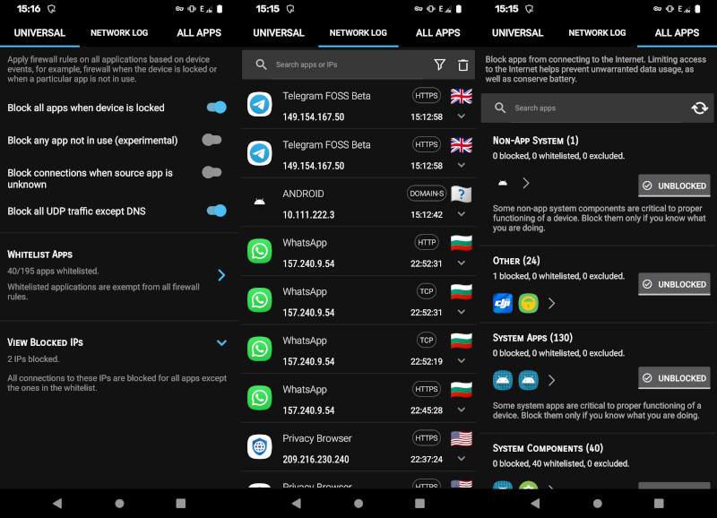
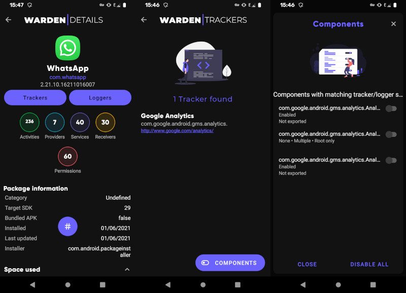
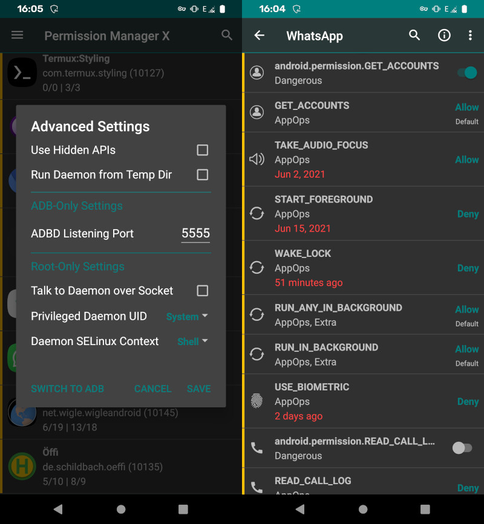
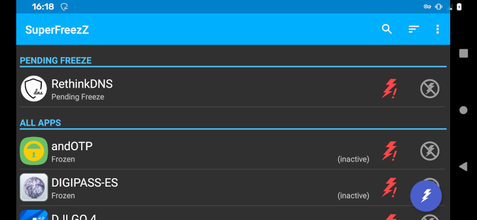

===
- date: 2021-06-15
- name: Android Privacy Guide
- tags: privacy, security, mobile
- type: software
- crux: Best Practices for Android Apps that respect your Privacy.
===

So you've installed LineageOS on your device, and now you're unsure
on how to proceed. You think that an AOSP-based build can't track you
because there's nothing installed on it - but that's where you're wrong.

This guide focusses on what to do to keep you safe, what to do and what
to prevent in order to further securing your Privacy on your smartphone.


## Prerequisites

Some steps in this guide require having a Rooted Phone, which means that
the `sudo` and `su` binaries need to be available in order to execute
commands with higher privileges (as the `root` user) on the system.

In case you don't come from the Unix world and don't know what `root` is
it's heavily recommended to not root your phone as you can easily brick
your device if you don't know what you're doing.


## Android Wi-Fi Connectivity Check

Android's integrated and non-deactivateable Wi-Fi Connectivity Check
sends your current approximate GPS location and your device's MAC address
every 10 seconds via the Wi-Fi's connection, so that Google can keep
track of where you are and what you do.

The data that is received by those domains contains the current NTP-verifiable
timestamp, the system's installed exact Chromium Webview and Android version, the
system's IMEIs and hardware MAC addresses, and of course the IP of the Wi-Fi
connection itself. This is certainly enough data to make any enduser uniquely
identifiable, which very likely is its purpose.

The only way to block them is by editing the system-wide `hosts` file, which
requires a rooted phone. In order to deactivate the tracking mechanism, you'll
also need either an `adb shell` or `Termux` installed.

Then you can edit the `/system/etc/hosts` file after remounting the system
partition with read and write access, as it's mounted with read access by
default.

```bash
[$] su -;                   # get root rights
[$] mount -ro remount,rw /; # remount system partition
[$] vim /system/etc/hosts;  # edit hosts file
```

As the Wi-Fi Connectivity Check is implemented pretty cleverly, it rotates
between a lot of google-owned domains once one of them is blocked. Therefore
the hosts file has to contain at least the following domains in order to block
access to them. Note that this will also block web access to those domains if
the Web Browser is not routed through TOR.

```hosts
127.0.0.1 localhost
::1       ip6-localhost

# These are all rotated domains for the Wi-Fi Connectivity Check as of AOSP version 10
127.0.0.1 play.googleapis.com
127.0.0.1 www.google.com google.com
127.0.0.1 www.google.ru google.ru
127.0.0.1 connectivitycheck.gstatic.com gstatic.com
127.0.0.1 time1.google.com
127.0.0.1 time.android.com
127.0.0.1 clients1.google.com clients2.google.com clients3.google.com
127.0.0.1 dns.google.com dns.google
```


## DNS and Firewall

Android 10 and later has integrated a so-called `Private DNS` feature in
the `Network and Internet` Settings. But as some might suspect, it's still
sending all DNS requests right to Google depending on which AOSP based
Android ROM you're using and what kind of patches were integrated in it.

The best recommendation for blocking and encryption of DNS requests is
[Rethink DNS](https://rethinkdns.com/app) which is a DNS, Firewall and VPN
App that allows to block network connections. It can also block both on a
per-IP basis for all other Apps and on a per-domain basis for DNS lookups.
Additionally, it allows to forward its requests to public DNS over TLS
resolvers, so that your ISP cannot track your DNS requests.



The screenshots show an example configuration of the App, and the Network
Log which allows to inspect what an App does on a per-connection basis.


## Detection of Trackers and Loggers

[App Warden](https://gitlab.com/AuroraOSS/AppWarden) is an open-source
tool which integrates the list of known trackers and loggers that is
maintained by the [Exodus Privacy](https://reports.exodus-privacy.eu.org/en/)
project.

Additionally, if the device is rooted, App Warden can modify and disable
Services and Components of the App. Depending on whether or not the App
is really dependent on the Trackers, it might be usable in a tracker-free
manner.



The screenshot shows the Scanner's view of `WhatsApp`, a privacy-invasive
App that uses Google Analytics to track its users - and how App Warden can
help disable these malicious App Components.


## Permission Management

[Permission Manager X](https://github.com/mirfatif/PermissionManagerX) is an
App that helps to modify App Permissions in a more detailed way. It uses the
`AppOps` API behind the scenes, which allows to override App Permissions and
ensure that the App cannot use features of your smartphone, even when the
App's Manifest includes those.

Additionally, the App can start an ADB session and a Debug Mode which allows
a developer to inspect all tracking features of an App on the fly.



The screenshot shows `WhatsApp`, a privacy-invasive App that uses a lot of
Android's available tracking features to spy on its users - and how Permission
Manager X can be used to deny these permissions via `AppOps` settings.


## App Suspension

Sometimes, Apps can be a little annoying and they constantly start themselves
when they're not supposed to. While Permission Manager can help with the
prevention of Apps that are starting themselves all the time, it's still
sometimes necessary to suspend an App that doesn't want to quit.

[SuperFreezZ](https://gitlab.com/SuperFreezZ/SuperFreezZ) is an App that allows
freezing a list of Apps easily, including System Apps.



The screenshot shows a list of Pending Freezes, which are configurable on a
per-App basis. Activating the Lightning Button on the bottom right will auto-freeze
all Apps that have pending freezes.


## (Offline) Navigation


## Public Navigation


## Terminal Emulation


## Web Browser

