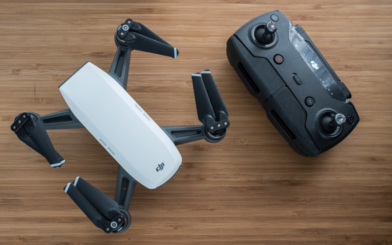

===
- date: 2019-12-01
- name: DJI Drone Reset Guide
- tags: dji, drone
- type: hardware, legacy
- crux: Personal notes on how to reset a DJI drone when it gets stuck or cannot be connected to.
===

These are my personal notes on how to reset a DJI drone when it gets stuck or cannot be
connected to. This sometimes happens when you use a remote that has a different Wi-Fi
and the drone is configured to connect to the remote's Wi-Fi first instead of creating
its own AP mode Wi-Fi.

## Reset Procedures

The DJI spark's reset procedures are dependent on pressing the power button for a specified time.

- after holding the power button for `3 seconds` it makes a single beeping sound.
- after holding the power button for `6 seconds` it makes a two-times beeping sound.
- after holding the power button for `9 seconds` it makes a three-times beeping sound.

### Reset Battery

How to turn off and on the battery:

Press the button a single time, then a second time while holding the button for at least
`2 seconds` to turn off the battery. After the battery was turned off, press the button a
single time to check the battery status.

If the indicator tells that it has enough power, you can turn the battery on again.

### Connect to Remote

How to connect the drone to the remote:

Hold down the power button on the drone for `3 seconds` until you hear the beeping sound.
Release the button after the beeping sound. The front LED of the drone will blink red now,
to indicate a successful connection to the remote.

### Disconnect from Remote

How to disconnect the drone from a remote:

In order to use the smartphone to control the drone, it must be disconnected from the remote
first. Turn on the drone and hold down the power button for `6 seconds` until a two-times
beeping sound can be heard. If the drone disconnected successfully from the remote, it will
create an AP mode Wi-Fi that can be used by the smartphone.

### Reset Wi-Fi SSID and Password

How to reset the Wi-Fi SSID and password of the drone:

Hold down the power button for `9 seconds` until a three-times beeping sound can be heard.
The Wi-Fi settings are then reset to factory settings, which means you can use the Wi-Fi
SSID and password that is labelled inside the drone's battery compartment or on the outside
of the grey safety box the drone is stored in.

Make sure you disable mobile 3G/4G data before you connect to the drone's AP mode Wi-Fi.

## Launch Procedures

### 1. Connect Smartphone to Drone

How to connect the smartphone to the drone's AP mode Wi-Fi:

If the drone was previously connected to a remote, it has to be disconnected from it first.
If the drone was shipped as a `Fly More Combo`, it is factory-configured to connect to a remote
controller.

On your smartphone:

- Start the `DJI Go 4` app from the App Store or Play Store.
- Open the `DJI Go 4` app and make sure it is set to connect to a DJI Spark (or your drone model).

On your drone:

- Insert the battery into the drone.
- Turn on the drone via one short press and one long press until the drone's fan activates.

On your smartphone:

- On the `DJI Go 4` app, enter the device and connect to the Spark's Wi-Fi network.
- Enter the password found under the battery on your DJI spark or from the grey safety case.
- After the smartphone connected to the drone, you will be asked to activate the product and check for firmware updates.
- After the potential firmware updates, turn off mobile data.

### 2. Launch Drone from your Hand

How to launch a drone from inside your hand via `PalmLaunch`:

Turn on the drone and place it on your flat hand, the camera aligned with your face.
Make sure that the fingers are under the arms of the drone, so that they cannot be hurt
when it changes its roll or pitch angles.

Press the power button quickly two times. The drone's front LEDs start to flash green.
After the drone's front LEDs blink yellow, FaceAware starts to scan your face. If the face
recognition was successful, the LEDs will change to green and PalmLaunch is active. If the
face recognition was unsuccessful, the LED will change to red.

