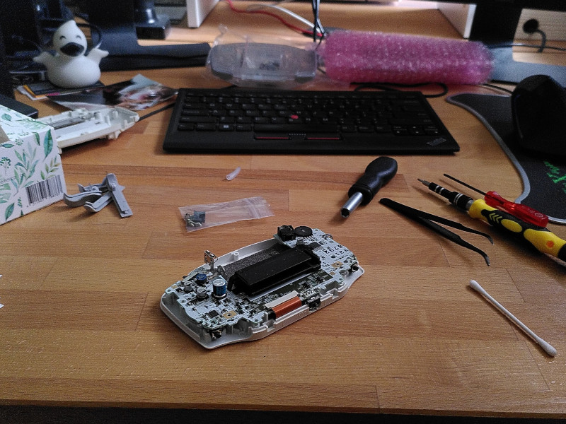
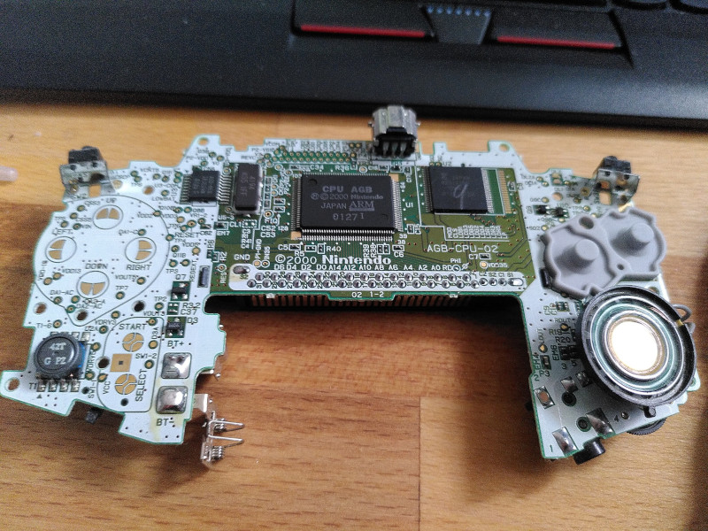
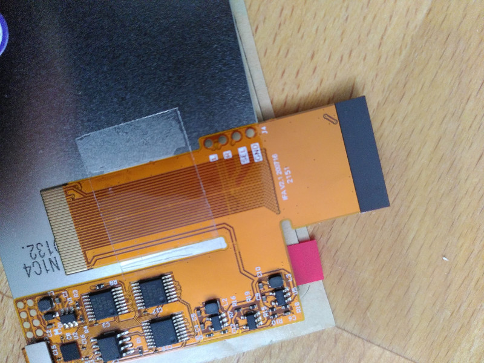
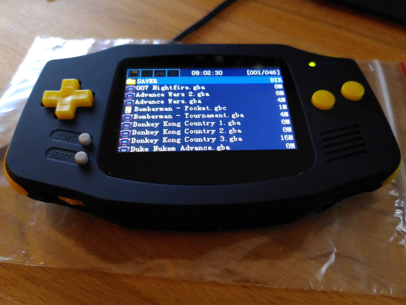

===
- date: 2023-03-01
- name: GameBoy Advance Mod
- tags: gameboy, modding
- type: hardware, legacy
- crux: Modding the GameBoy Advance to make it much more fun to play with, including retrosix case mod, backlit LCD display mod, USB-C mod, and EZFlash Omega for more convenient gameplay.
===

The GameBoy Advance mod includes a RetroSix matte case, a better display, and more
convenient gameplay with an EZFlash Omega cartridge that allows to store `.gba`
files on a microSD card, so that I don't have to carry around all the game cassettes
everywhere to use it.

### Parts List

- GameBoy screw driver (Gamebit 3.8mm)
- FunnyPlaying IPS LCD V2 GBA Kit
- CleanJuice GBA USB-C battery pack
- RetroSix GBA matte black shell case (with bigger screen window, for IPS mod)
- GBA USB-C matte black battery cover
- RetroSix GBA yellow buttons
- RetroSix GBA grey silicone pads
- RetroSix GBA IPS glass screen

### Teardown

The teardown is quite easy.

It is only necessary to remove all screws from the case and once the display can be removed
a little carefulness is required to not damage the display connector. Remove the display
connector by pushing the two little pins to the front, so that the flex cable is loose
and can be removed without force.

The original display itself is glued on some plastic displacement pads, and its dimensions
won't fit the IPS-ready GBA shell case. The FunnyPlaying IPS LCD display is a little larger
than the original display, that's why it's important to get an IPS-ready shell case so that
you don't have to cut into the plastic.

### Cleanup

I cleaned up the PCB so that all the pins and connectors last a little longer. A typical
failing part of the PCB are the L1 inductor and the T1 transformer, but you can order that
on eBay and replace them with new ones.

If you didn't order new silicone pads, it's important to also clean those so that the buttons
keep working when you place them in the new shell case again. I used some isopropanol-based
alcohol and some Q-tips to clean everything, and it worked quite nicely.

### IPS Display Mod

The IPS display doesn't need any wiring or soldering, as the cables for controlling its
brightness are optional. I decided to not connect the wires of the IPS display to the PCB,
because I liked the default brightness and I didn't want to ruin the clean PCB with some
crappy soldering.

As you can see in the picture, the brightness functionality would require four different
pins being soldered to the PCB's buttons:

- `SEL` needs to connect to the `select` connector on the PCB which is marked as `TP2` southeast to the arrow keys.
- `R` needs to connect to the northwest pin of the `right` button switch which is marked as `SW2` on the PCB.
- `L` needs to connect to the northwest pin of the `left` button switch which is marked as `SW3` on the PCB.
- `GND` needs to connect to the `-` (negative/ground) connector on the PCB, which is optional.

### Assembly

The assembly is quite easy and doesn't need glue. I decided to not use any adhesive so that
I can repair it much easier in the future in case the T1 transformer fails me. The IPS display
glass came with adhesive under it so it's stickied to the shell case when you press it on.
Make sure to cleanup everything under and over it, otherwise you're going to have some nasty
dirt under it that will annoy you real quick.

### EZFlash Omega

I'm mentioning the EZFlash Omega Cartridge because it's just so much more convenient to use
the GameBoy Advance with it. It's basically a flash drive that needs a `FAT32` formatted
microSD card, and you can put all `GBA ROMs` on in its folders.

Savegames are stored for each game that you play (using the file's `basename` as an identifier)
inside the `/SAVER` folder.

There's also theoretical support for Xploder cheat codes, but I haven't figured that out yet.
The cheatcode database that's available online is in Chinese, and I am kind of lost in translation
there, because the cheatcode format isn't explained very well and the offsets don't make sense.

At some point I might update this article in case I figure out how to use the old cheatcodes,
or probably gonna build a little tool for it when I have the time.

I hope you liked this little write-up and that you're going to enjoy your GameBoy Advance for
the next couple years to come. Happy modding!

