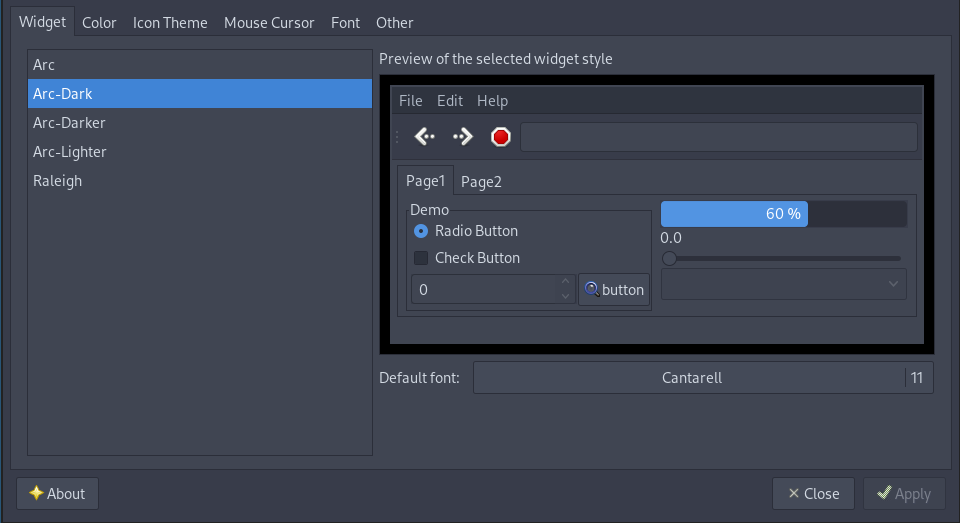

===
- date: 2020-11-11
- name: i3 Migration Guide
- tags: linux, desktop
- type: software, legacy
- crux: How to migrate from GNOME to i3, step by step with explanations for typical keybindings, configuration problems and status bar integrations.
===

Today I decided to ditch GNOME.

I know, I know, you probably expect yet another rage post about
why GNOME is shit, and why MATE is better and other opinionated
raging comments - but nope, I'm not gonna do that.

In my case a minor update occured to 3.38.1, which led to `mozjs`
not being able to run without a segfault on my laptop anymore.

Turns out, pretty much everything in the GNOME ecocystem depends
on `gjs` to function properly, so not even GDM was able to run
without a segfault.


## Tiling Window Manager(s)

As I've maintained my own GNOME shell extension for a while to
get a somewhat tiling window manager functionality, I thought
I'll give another window manager a try again.

Back in the days before even XFCE or LXDE were cool, I was using
openbox and fluxbox for a long time, because I never liked KDE's
approach to being a Windows look and feel and GNOME wasn't ready
for daily usage at the time.

Eversince GNOME 3 came out I switched to it, and got stuck with
it for the sake of simplicity. First as an apt shadow on Debian
and Ubuntu - and later as an Arch user.

Nonetheless I decided to try out [i3wm](https://i3wm.org) again,
because last time it was in its very early development phase
and I thought it would be fair to give it another chance.


## i3 Installation

It's best to install the i3 window manager along with `dmenu` and
`i3status` as they are very nicely integrated.

On a laptop with a modifiable brightness function (Fn) keys, it
is highly recommended to install `brightnessctl`. `brightnessctl`
allows incrementing and decrementing the brightness in percentages,
so you don't have to build your own wrapper script for that.

For networking, I decided to stay with `network-manager`, as I'm
using it in combination with `modem-manager` all the time for 4G
internet access. In order to make this work, `network-manager-applet`
will help.

On a machine with Bluetooth, `blueman` also includes an applet
that can be used similar to the Network Manager Applet.

All in all, these were the necessary base packages to get going:

```bash
sudo pacman -S i3-wm i3status dmenu brightnessctl blueman network-manager-applet;
```


### Xorg Configuration

In order to use i3wm, you'll need a couple of things.

As i3 is not a Desktop Environment and only a window manager, you'll have
to configure X11 (Xorg) first in order to use it with multiple screens.

The details of the currently connected monitors can be gathered by using
the `xrandr` tool. The output will show all connected (and disconnected)
displays and their supported resolutions, whereas by default they'll use
the maximum resolution available.

Quick important sidenotes:

- Xorg/X11 is using the `width x height + offset_left + offset_top` syntax.
- If the monitors are setup incorrectly, all monitors appear with a `...+0+0` output.
- If the monitors are setup correctly, they appear all with a different offset like in the example.

If the monitors are connected and not configured as multiple screens, they'll
appear like this if you execute `xrandr`:

```bash
$ xrandr
(...)
HDMI1 connected 1920x1080+0+0 (normal left inverted right x axis y axis) 540mm x 300mm
(...)
HDMI2 connected 1920x1080+1920+0 (normal left inverted right x axis y axis) 540mm x 300mm
(...)
HDMI3 connected 1920x1080+3840+0 (normal left inverted right x axis y axis) 540mm x 300mm
```

In my case the monitors are connected next to each other in a horizontal
line, from left to right. The `/etc/X11/xorg.conf.d/10-monitors.conf`
file therefore has to look like this:

```bash
Section "Monitor"
	Identifier "HDMI1"
	Option "Primary" "true"
EndSection

Section "Monitor"
	Identifier "HDMI2"
	Option "LeftOf" "HDMI3"
	Option "RightOf" "HDMI1"
EndSection

Section "Monitor"
	Identifier "HDMI3"
	Option "RightOf" "HDMI2"
EndSection
```


### i3 Configuration

The default setup of i3wm is pretty straight-forward as a baseline.

The first time you start an i3 session, it will ask you to create a config
file with the defaults and the file will be located at `~/.config/i3/config`.


**Keyboard Shortcuts**:

All keyboards are different, but in my case I wanted the same integration
with the `Windows` key that I had before, so I chose to use the `Mod4` key.

Most Function (Fn) keys are prefixed with `XF86` and you can detect them
by running `xev` and pressing the keys on the keyboard.

I also didn't like the VIM-style arrow key bindings (h/j/k/l) because well,
I have an opinion on that.

**Emojis**:

The config file of i3 supports emoji rendering, which is quite nice if you
want to show icons next to the information.

In order to use that, you'll need `Google Noto(fu) Fonts` installed, along
with `DejaVu Sans` or any other full-range UTF8/UTF16 compatible font.

```bash
sudo pacman -S ttf-dejavu noto-fonts noto-fonts-emoji noto-fonts-extra;
```

i3 uses Pango as a text rendering library. In order to select the correct
font, you'll need to use the syntax `font pango:Font Identifier <size in pt>`.

In my case I decided to go with `DejaVu Sans Mono` with a `12 pt` font size
to make emojis available in the `i3status` bar.


**i3 Config**:

In my case, the setup looks like this:

- Use the `Windows` key as Modifier.
- Integration with `pulseaudio` (`pactl`).
- Integration with `brightnessctl`.
- Integration with `networkmanager` (`nm-applet`) that appears in the systray.
- Change the key refresh rate to `250ms` delay and `50 keys/second` afterwards.
- Bind `[Win]+[D]` to open `dmenu` to search for a Desktop Application.
- Bind `[Win]+[Q]` to close an application window.
- Bind `[Win]+[Enter]` to open a Kitty terminal window.
- Everything else is pretty much defaulted key bindings.

```config
set $mod Mod4

default_border pixel 2
hide_edge_borders smart

font pango:DejaVu Sans Mono 12

exec --no-startup-id blueman-applet
exec --no-startup-id nm-applet
exec --no-startup-id xset r rate 250 50

set $refresh_i3status killall -SIGUSR1 i3status

bindsym XF86AudioRaiseVolume exec --no-startup-id pactl set-sink-volume @DEFAULT_SINK@ +10% && $refresh_i3status
bindsym XF86AudioLowerVolume exec --no-startup-id pactl set-sink-volume @DEFAULT_SINK@ -10% && $refresh_i3status
bindsym XF86AudioMute exec --no-startup-id pactl set-sink-mute @DEFAULT_SINK@ toggle && $refresh_i3status
bindsym XF86AudioMicMute exec --no-startup-id pactl set-source-mute @DEFAULT_SOURCE@ toggle && $refresh_i3status
bindsym XF86MonBrightnessUp exec --no-startup-id brightnessctl set "2%+"
bindsym XF86MonBrightnessDown exec --no-startup-id brightnessctl set "2%-"

floating_modifier $mod

bindsym $mod+Return exec kitty
bindsym $mod+q kill
bindsym $mod+d exec --no-startup-id i3-dmenu-desktop

bindsym $mod+Left focus left
bindsym $mod+Down focus down
bindsym $mod+Up focus up
bindsym $mod+Right focus right

bindsym $mod+Shift+Left move left
bindsym $mod+Shift+Down move down
bindsym $mod+Shift+Up move up
bindsym $mod+Shift+Right move right

bindsym $mod+h split h
bindsym $mod+v split v
bindsym $mod+f fullscreen toggle

bindsym $mod+Shift+space floating toggle
bindsym $mod+space focus mode_toggle

set $ws1 "1"
set $ws2 "2"
set $ws3 "3"
set $ws4 "4"
set $ws5 "5"
set $ws6 "6"
set $ws7 "7"
set $ws8 "8"
set $ws9 "9"
set $ws10 "10"

bindsym $mod+1 workspace number $ws1
bindsym $mod+2 workspace number $ws2
bindsym $mod+3 workspace number $ws3
bindsym $mod+4 workspace number $ws4
bindsym $mod+5 workspace number $ws5
bindsym $mod+6 workspace number $ws6
bindsym $mod+7 workspace number $ws7
bindsym $mod+8 workspace number $ws8
bindsym $mod+9 workspace number $ws9
bindsym $mod+0 workspace number $ws10

bindsym $mod+Shift+1 move container to workspace number $ws1
bindsym $mod+Shift+2 move container to workspace number $ws2
bindsym $mod+Shift+3 move container to workspace number $ws3
bindsym $mod+Shift+4 move container to workspace number $ws4
bindsym $mod+Shift+5 move container to workspace number $ws5
bindsym $mod+Shift+6 move container to workspace number $ws6
bindsym $mod+Shift+7 move container to workspace number $ws7
bindsym $mod+Shift+8 move container to workspace number $ws8
bindsym $mod+Shift+9 move container to workspace number $ws9
bindsym $mod+Shift+0 move container to workspace number $ws10

bindsym $mod+Shift+c reload
bindsym $mod+Shift+r restart
bindsym $mod+Shift+Escape exec "i3-nagbar -t warning -m 'Exit i3?' -B 'Yes, exit nao.' 'i3-msg exit'"

mode "resize" {

	bindsym Left resize shrink width 10 px or 10 ppt
	bindsym Down resize grow height 10 px or 10 ppt
	bindsym Up resize shrink height 10 px or 10 ppt
	bindsym Right resize grow width 10 px or 10 ppt

	bindsym Escape mode "default"
	bindsym $mod+r mode "default"

}

bindsym $mod+r mode "resize"

bar {
	status_command i3status
}
```


### i3status Configuration

The `i3status` bar is configurable based on the idea that
either internal modules are provided for quick and easy
status integrations - or that external programs are run
on a regular basis (e.g. every 10 seconds) in order to
provide the status message.

In fact, if you run `i3status` in the Terminal you'll see
the details of what's being rendered in a JSON formatted
output.

The `order` string (array?) is generated by calling the
modules from left to right in order to render the status
bar.


**Wi-Fi and Ethernet**:

Internal Modules of `i3status` can be reused multiple
times with a different identifier. For example, there can
be `wireless wlan0` and `wireless wlp0s3` in parallel.

In order to make Modules work on different machines, I
decided to use the `_first_` identifier for both Wi-Fi
and Ethernet, so that the first interface will be
automatically selected no matter if it's named `wlan0`
or `wlp0s0` or otherwise.


**CPU temperature**:

The `cpu_temperature` module depends on the `temp1_input`
file in `/sys/devices/platform/coretemp.X/hwmon/hwmonY/`
wherease X and Y may vary depending on the CPU used in
the system.

Potential pitfall might be that your system doesn't have
a CPU temperature sensor for the first core, and only
the second one, so you would need to verify that manually.

```bash
[$] cat /sys/devices/platform/coretemp.0/hwmon/hwmon4/temp1_input;
58000
```

The output of that file should be in millidegree Celcius,
which means that the example represents 58.00 C.


**Audio Volume Levels**:

The volume levels are a different story. As pulseaudio is
very dynamic in nature, there's no easy way to predict
an audio setup.

In my case I decided to go with the `master` stream, which
is the one that's being used for the primary analog output
(aka Laptop speakers or headphones connected via cable).

But, in case you want to integrate a Bluetooth speaker, this
might not be as easy. In order to find out the configuration
you need `pactl` installed (and probably `pavucontrol` while
you're at it, too).

The format of the configuration file is `pulse:<audio sink id>`
or `pulse:<audio sink name>`.

In my case, that means that the `pulse:0` stands for the `Sink #0`
which is the `alsa_output.pci-0000_00_1b.0.analog-stereo` device.

```bash
[$] pactl list sinks;
Sink #0
	State: SUSPENDED
	Name: alsa_output.pci-0000_00_1b.0.analog-stereo
	(...)
```

**Bluetooth Audio**:

If you connect your bluetooth headphones via the `blueman-applet`,
they'll start to appear as sinks in `pactl` with a unique identifier
that is per-device as it encodes the BT MAC address.

```bash
[$] pactl list sinks;
Sink #17
	State: IDLE
	Name: bluez_sink.AB_CD_EF_12_34_56.a2dp_sink
	(...)
```

So, in order to integrate their volume with the `i3status` bar,
you'll have to use the `pulse:<audio sink name>` syntax, which
I'm not totally happy with right now because it's a bit redundant
to have multiple volumes in the status bar being displayed.


**Microphone Volume Level**:

What I haven't figured out so far is how to integrate my
microphone volume level into the status bar. As the microphone
is part of my `Built-In Audio Analog Stereo` device, but a
different port than master, it seems that i3status cannot
integrate this.

Even when using the correct `source` identifier, it is always
at `0%` which seems to be the default value for the pulseaudio
module.

But I'll have to dig into the codebase to be absolutely sure
about this. So far most stackoverflow posts have been not
helpful at all.


**i3status Config**:

```config
general {
	output_format = "i3bar"
	colors = true
	interval = 10
}

order += "wireless _first_"
order += "ethernet _first_"
order += "battery 0"
order += "cpu_temperature 0"
order += "volume microphone"
order += "volume speakers"
order += "volume bluetooth"
order += "memory"
order += "tztime local"
order += "tztime berlin"

wireless _first_ {
	format_up = "📡%quality at %essid, %bitrate"
	format_down = "📡 down"
}

ethernet _first_ {
	format_up = "🖥️ %speed"
	format_down = "🖥️ down"
}

battery 0 {
	format = "%status %percentage %remaining %emptytime"
	format_down = "No battery"
	status_chr = "⚡"
	status_bat = "🔋"
	status_unk = "❓"
	status_full = "☢️"
	path = "/sys/class/power_supply/BAT%d/uevent"
	low_threshold = 10
}

cpu_temperature 0 {
	format = "🌡️ %degrees°C"
	path = "/sys/devices/platform/coretemp.0/hwmon/hwmon4/temp1_input"
}

volume bluetooth {
	format = "🎧🔊 %volume"
	format_muted = "🎧🔊🔇"
	device = "pulse:bluez_sink.FC_58_FA_78_33_42.a2dp_sink"
}

volume microphone {
	format = "💻🎤 %volume"
	format_muted = "💻🎤🔇"
	device = "pulse:alsa_input.pci-0000_00_1b.0.analog-stereo"
}

volume speakers {
	format = "💻🔊 %volume"
	format_muted = "💻🔊🔇"
	device = "pulse:alsa_output.pci-0000_00_1b.0.analog-stereo"
}

memory {
	format = "♻️ %used"
	threshold_degraded = "10%"
	format_degraded = "MEMORY: %free"
}

tztime local {
	format = "📅 %Y-%m-%d %H:%M:%S"
}

tztime berlin {
	format = "📅 %Y-%m-%d %H:%M:%S %Z"
	timezone = "Europe/Berlin"
	hide_if_equals_localtime = true
}
```


### Cursors, Icons, and Themes

The cursor theme for Xorg is located in `/usr/share/icons/default`,
but it sometimes isn't applied correctly. A quick fix here is to
create a symbolic link inside your home folder to it:

```bash
mkdir -p $HOME/.icons/default;
ln -s /usr/share/icons/default/index.theme $HOME/.icons/default/index.theme;
```

If you want to change the GTK theme and GTK icon theme for GTK-based
applications, I would recommend to use the `lxappearance` tool. It allows
to select all themes, color schemes, fonts, cursors and other accessibility
related settings - and it does not have any third-party dependencies.



After `lxappearance` has saved the Theme settings, it's creating
the GTK settings file located at `~/.gtkrc-2.0`.

```config
gtk-theme-name="Arc-Dark"
gtk-icon-theme-name="Numix"
gtk-font-name="Cantarell 12"
gtk-cursor-theme-name="Breeze"
gtk-cursor-theme-size=0
gtk-toolbar-style=GTK_TOOLBAR_BOTH
gtk-toolbar-icon-size=GTK_ICON_SIZE_LARGE_TOOLBAR
gtk-button-images=1
gtk-menu-images=1
gtk-enable-event-sounds=1
gtk-enable-input-feedback-sounds=1
gtk-xft-antialias=1
gtk-xft-hinting=1
gtk-xft-hintstyle="hintfull"
```


### Other Software

As above setup isn't really a complete Desktop Environment,
I would recommend some other software due to better integrations
with common tasks.

- `celluloid` as a Media Player.
- `file-roller` as an Archive tool.
- `nemo` as a File Manager, as it is a fork of nautilus that doesn't need gsettings or dconf.
- `gpicview-gtk3` as an Image Viewer.

Rather than that I am still using `authenticator` and `gnome-keyring`
for daily integrations with Web Browsers and 2FA one time passwords.

