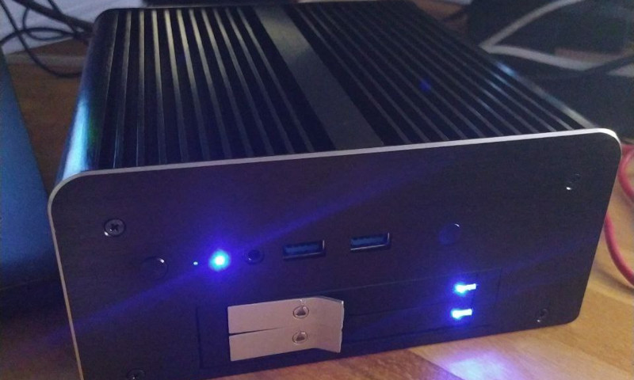

===
- date: 2022-06-01
- name: Intel NUC Homeserver
- tags: linux, devops
- type: software, research
- crux: How to build your own little Home Server with a cheap Intel NUC from eBay.
===




Today I decided to build a little Home Server.

In order to save some money (and electricity) I decided to ditch my huge-ass PC tower
with 3 graphics cards in order to have a nice and small home server that I can experiment
with.

This little Intel NUC will also be the local self-hosted solution for our git repositories,
so we are going to install the [Go Git Service (gogs)[https://gogs.io) on it via their
provided Docker image.


## Hardware

The hardware is a little specific in my case, because I'm currently on a trip to remove
all noisy fans in my work environment. Technically, any Intel NUC will suffice, but in
my case I went for the fanless case first and then got the matching NUC mainboard.

Additionally I wanted to have a second SSD so that all data can be easily cloned or
replicated with `dd`, whereas the OS and all other stuff is on a separate SSD.

The Akasa Max MT6 is a little quirky because its USB cables are too long and too sturdy,
so if you don't remove the plastic around the cables they will probably rip-off the USB
soldered connectors on the board.

In my case, I got two simple SATA 512GB SSDs because they were the cheapest for the volume.
Prices kinda explode when you go for 2TB and upwards, but 512GB for my git repositories is
enough. I'm using an external 8TB WD Purple hard drive for my movies collection anyways.

- `/dev/sda` will be the `boot` and `/ (root)` partition.
- `/dev/sdb` will be the `/home` folder.
- `/dev/sdc` during boot will be the USB installation flash drive, after installation it will be the USB hard drive.


### Hardware Bill of Materials:

The bill of materials is pretty small. Most of the items I got on eBay. Overall, I spent
around 500 EUR on this project. As I'm going to experiment a lot with this Intel NUC in
the future, I decided to max out the possible RAM with 2x 8GB DIMMs.

- Intel NUC `NUC5i3RYH`, see [specifications](https://ark.intel.com/content/www/us/en/ark/products/83257/intel-nuc-kit-nuc5i3ryh.html)
- (optional) Akasa Max MT6 fanless case, see [specifications](https://www.akasa.com.tw/update.php?tpl=product/product.detail.tpl&no=181&model=A-NUC29-A1B)
- (optional) 2x 8GB `DDR3L-1600 1.35V SO-DIMM`
- (optional) 2x Intenso 512GB SATA III SSD


## Software

### Installation of Arch Linux

[ArchLinux](https://archlinux.org/) will be the host operating system.

As the Intel NUC comes with a `Visual BIOS` and `UEFI boot` support, the installation
is quite easy and we don't have to deal with `GRUB` and its legacy `BIOS` boot quirks.

We're going to still use `GRUB` instead of `systemd-boot` though, as I want to reserve
the possibility of replacing the second SSD with another operating system on it, so that
we can have a multi-boot setup without having to change any configuration files. It's
an experimental Home Lab setup after all.


## TODO: NOTES UNSORTED

```bash

fdisk /dev/sda; # create sda1 as root and sda2 as 8309 (LUKS)

cryptsetup luksFormat /dev/sda2;
cryptsetup open /dev/sda2 root;
mkfs.ext4 /dev/mapper/root;

mkdir /mnt;
mount /dev/mapper/root /mnt;

mkfs.fat -F32 -n BOOT /dev/sda1;
mkdir /mnt/boot;
mount /dev/sda1 /mnt/boot;

mkdir /mnt/boot/efi;

pacstrap /mnt base base-devel linux linux-firmware vim;

genfstab -...

blkid -s UUID /dev/sda2;
# edit /etc/crypttab with
# root UUID=... none
```

```bash
arch-chroot /mnt;
pacman-key --init;
pacman-key --populate archlinux;

echo "en_US.UTF-8" > /etc/locale.conf;
locale-gen;
export LANG="en_US.UTF-8";
ln -sf /usr/share/zoneinfo/Europe/Berlin /etc/localtime
hwclock --systohc --utc;

echo myhostname > /etc/hostname;
# TODO: edit /etc/hosts with standard hosts entries

pacman -S grub efibootmgr;

grub-install --target=x86_64-efi --root-directory=/mnt --efi-directory=/mnt/boot/EFI /dev/sda;


pacman -S networkmanager openssh;

useradd -m -g users -G wheel cookiengineer;
passwd cookiengineer;

umount -R /mnt;

```


### TODO: Installation from Flash Drive


### Installation of Pi-Hole FTL DNS Resolver

Pi-Hole's Faster Than Light DNS resolver is available as a standalone package
on AUR. So we're going to install the package and its dependencies.

First, we are installing the [Pi-Hole FTL Package from AUR](https://aur.archlinux.org/packages/pi-hole-ftl):

```bash
sudo pacman -S base-devel;

# Install Pi-Hole FTL
mkdir -p ~/Packages/pi-hole-ftl;
git clone https://aur.archlinux.org/pi-hole-ftl.git ~/Packages/pi-hole-ftl;

cd ~/Packages/pi-hole-ftl;
makepkg -sf;
sudo pacman -U pi-hole-ftl-*.pkg.tar.zst;
```

Then, we are installing the [Pi-Hole Standalone Package from AUR](https://aur.archlinux.org/pi-hole-standalone):

```bash
sudo pacman -S base-devel;

# Install Pi-Hole Standalone
mkdir -p ~/Packages/pi-hole-standalone;
git clone https://aur.archlinux.org/pi-hole-standalone.git ~/Packages/pi-hole-standalone;

cd ~/Packages/pi-hole-standalone;
makepkg -sf;
sudo pacman -U pi-hole-standalone-*.pkg.tar.zst;
```

### Configuration of Pi-Hole FTL DNS Resolver

We need to make sure that the Pi-Hole FTL Service uses the correct `gravity.db`
file, which contains our generated list of blocked advertising domains.

As the `gravity.db` file is generated via the `pihole -g` command (and the now
already installed weekly `pi-hole-gravity.timer`), we have to let the FTL
service know where exactly it can find it.

Additionally we don't want to log DNS queries to our server for longer than
a week, so we set `MAXDBDAYS` to `7 days`.

```bash
# /etc/pihole/pihole-FTL.conf

SOCKET_LISTENING=all
RESOLVE_IPV6=yes
RESOLVE_IPV4=yes

DBFILE=/etc/pihole/pihole-FTL.db
GRAVITYDB=/etc/pihole/gravity.db
MAXDBDAYS=7
```

If we enable and start the `pihole-FTL.service` now, we're fully setup with
our adblocking DNS server. We now can use the Network Connection settings
on other devices to manually set the DNS to the static IP of our homeserver,
and it will automatically block all advertising DNS requests and answer them
with `NULL` (`0.0.0.0`).

If we run `nmap` to verify that the service is running, we can see that the
DNS server is active on port `53`.

```bash
# Manually update the gravity.db for the first time
pihole -g;

sudo systemctl enable pihole-FTL;
sudo systemctl start pihole-FTL;

# Verify that pihole-FTL is running
nmap localhost;
```

