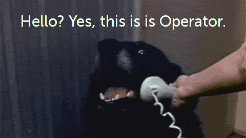

===
- date: 2019-04-26
- name: Maintenance of Clearnets
- tags: privacy, security, network, web browser
- type: legacy
===


In order to understand how we can break out of Prison, we must first
understand how the Prison operates, how the Guards spot means of
Breakouts (Tools, Weapons), how they rotate their watch shifts; and
how they generally behave and react to things that are going on inside
the Prison.

The same applies for a Breakout of the Clearnet. In general, Internet
Service Providers (ISPs) use a couple of techniques in parallel to make
your experience of the Internet as bad as possible.

When we talk about how they operate, we must assume that the ISP is
always the Man in the Middle (MITM) and can read, understand and
manipulate any unencrypted data that is transferred between you, Alice,
and Bob, the server that you're communicating to.


### Operating System

In general I'd recommend to use an up-to-date Linux Distribution for
means of access of the internet. Network behaviour on MacOS and Windows
cannot be guaranteed anyhow; therefore it is heavily disrecommended
if you're serious about your Privacy.

And you should be, because Governments have lots of Exploits already
available that are automatically installed on your Computer; no matter
if you're the bad guy or a nice guy. They don't care.


### General Hints for Dealing with Customs

There are a couple of rules on how to behave with Customs. Since a while
ago they're looking for suspicious things, so while you're still under
oath you can still plausibly deny what they're suggesting.

- Always use an up-to-date FULL Linux installation like [Arch Linux](https://archlinux.org).
- Always encrypt all your partitions with [LUKS](https://wiki.archlinux.org/index.php/LUKS).
- Always use a small Nano USB thumbdrive as a crypto unlock keyfile in combination with a password.
- Always physically power down your Laptop and remove the battery and thumbdrive before going through Customs.

Additionally I'm using some special techniques that have been proven to
work so far. I also generated a custom `initramfs` which removes the
Password Dialog and prints out nothing, while waiting in the background
for a password for 30 seconds until it boots up.

This way when I try to bootup the machine with Customs watching me, I can
deny knowing about the Encryption of the HDD/SDD and can say that it was
working before and that the Laptop is broken now.

If they don't see hints about a password, they ain't gonna ask you about it.

What's also very nice is when you travel with a Dog or Cat that comes
with a Necklace. There are lots of Nano USB thumbdrives that perfectly
fit in the Necklace of a Dog Tag or a Pet's name sign. Alternatively
lots of people use thumbdrives hidden in a Wedding-Ring as I've seen.

Remember that an X-Ray scan will be done in case things go wrong, so
a Dog Tag can easily be denied and you can say it's something like a
Dog Tag with a GPS in it or you can hide the keyfile as a `RETURNME.md`
that has your address in it.

Note that Customs has an NTFS-Stream detecting Forensics software, so
the cheap tricks ain't working here and you gotta go the
[steganographic way](https://steghide.sourceforge.net) with an audio
or raw camera image file (the bigger the better). The Entropy gets
better if you hide a keyfile within another file and make that file
your keyfile.

If you can, you should use [LibreBoot](https://libreboot.org) compatible
Hardware, which means it is a bit outdated by modern performance standards
though the benefits of the better UEFI replacement far outweight Customs
having a Super Password to bootup your Laptop even when UEFI is locked.

In times of Bugs, Backdoors and Exploits in more modern Intel processors
I'm quite happy with that decision.

You'll be amazed how often Customs will ask you whether your Laptop is
broken or not when they cannot boot it up ... which should give you a
hint that they unsuccessfully tried to invade your Privacy, and tried
to install Spyware on your Computer without your permission.


## The OSI Model

In order to understand how the Prison operates, you have to understand
how the internet and its underlying network infrastructure works.

When talking about the Web, most people understand it as `E-Mail` and
`Websites`, maybe even `VPN` but not nerdy things like IRC or ICMP.

Therefore this Guide will focus on the problems of `TCP` and `UDP`
based internet connections.

When talking about Network Protocols, they are divided in different
OSI layers which each add different capabilities to the network protocol.
These days the lines in between blurr up a little, but the basic
principles are the same.

The OSI Layers that are interesting to us are:

1. The `Physical Layer` connects machines via a transmission medium, like a network cable (or Wi-Fi or radio).
2. The `Data Link Layer` links specific machines together, which are addressed via `MAC addresses` (also known as hardware addresses).
3. The `Network Layer` links specific network sockets together, which are addressed via `IP addresses`.
4. The `Transport Layer` defines the network socket data frames and its contents and mechanics (like `TCP` or `UDP`).
6. The `Session Layer` defines ids and temporary sessions. In our case this is only interesting for the `SOCKS` proxy routing protocol.
7. The `Presentation Layer` defines encryption/decryption, for example an `SSL` or `TLS` session.
8. The `Application Layer` is the high-level network protocol that Applications work with, for example `HTTP/HTTPS` or `SMTP/IMAP`.

Usually when network administrators talk about broken infrastructure,
they tend to talk about which OSI layer is affected by the Bug. This
helps them to identify the Bug more quickly and to trace down the
broken Hardware or Firmware/Software.

A broken OSI Layer 1 means that a Network Hub or a Network Cable is
broken. When OSI Layer 2 is affected, it concludes that a Network
Switch or a piece of software (Firewall) that knows things about MAC
and IP relationships is not working. When OSI Layer 3 is broken, it
usually means that a Router or Gateway doesn't work as intended.

This goes on and on for each OSI Layer, in our case only these three
layers are generally interesting when breaking out of the Clearnet
(Censored Internet).


## Blocking Techniques

There are several ways on what is actually done in order to block as
much "unwanted" Network Traffic as possible. Most of the time, only
one of the following Hurdles is actually necessary; but most
Governments have multiple ones in place to achieve maximum control
of their Zombie inhabitants.


### MAC Address Blocking (Layer 2)

In general, network connections are automatically tagged by ISPs. If
they can see your MAC address, they'll also identify you by your MAC
address. Many "Free Wi-Fi" Router Firmwares actually report the
contents of their Network Address Translation Table (NAT) and therefore
the MAC and IP addresses back to the ISPs.

That's why it's important to randomize your MAC address not only for
Wi-Fi connections, but also for cable connections.

```bash
# Assumes enp3s0 is your cable connection
sudo macchanger -r enp3s0;

# Assumes wlp3s0 is your wifi connection
sudo macchanger -r wlp3s0;
```

Deactivate all Wi-Fi autoconnect features in order to prevent being
traceable by the Wi-Fi networks that your Wi-Fi card tries to ping
when being disconnected.

In [Network Manager](https://wiki.gnome.org/Projects/NetworkManager)
Profiles, you can add these settings to your connection that is
located at `/etc/NetworkManager/system-connections/*.nmconnection`.

Edit the file as `root` (meaning `su -` and not via `sudo`) and
keep the `chmod` of the file identical. Otherwise NetworkManager
will forget the connection settings and mess things up.

```ini
; Generate mac-address via macchanger -sr wlp3s0

[connection]
id=Example-WiFi
(...)
type=wifi
autoconnect=false

[wifi]
mac-address=00:01:02:03:04:05

[ipv4]
dhcp-send-hostname=false

[ipv6]
dhcp-send-hostname=false
```


### TCP RST Injection (Layer 4)

TCP is a very nice Network Protocol, but it has an essential flaw which
is called Fragmentation.

The underlying TCP data frame starts with a so-called `FIN` flag, which
represents whether or not the data frame is `finished` and can be
processed by the software that receives it.

If the `FIN` flag is set to `0`, it means that the software will continue
to wait until new data arrives; and try to put the upcoming chunks together
when they arrive; into this big, locally maintained history of past
uncomplete chunks.

Additionally, TCP has a feature called `RST` which is vulnerable to a
so-called [TCP reset attack](https://en.wikipedia.org/wiki/TCP_reset_attack).

The important part here is not the attack scenario itself and that it kills
the TCP connection, but the behaviour of the software using a TCP socket.

Generally software tries to recover from reset or timed out connections,
so in the Web Browser scenario (producing the most internet traffic from
an ISPs perspective) the network implementations will steadily try to
reconnect and load the next part of the file with mechanisms like
[Partial Content](https://developer.mozilla.org/en-US/docs/Web/HTTP/Status/206)
or [Range Requests](https://developer.mozilla.org/en-US/docs/Web/HTTP/Range_requests).

All the ISP has to do to slow you down is listen for connections that
try to connect to a list of known CDNs or video delivery networks and
modify the `FIN` flags and `RST` flags of that particular connection.

Usually they also time their attacks based on known software, so they
test against commonly known Browsers (read as "Blink", "WebKit" and "Gecko").
That means in the real world scenarios they just mess around the socket
for the first `~30 seconds` until the actual payload arrives at the Client.

This might not seem long, but have you seen a Website and its resources
lately? Hundreds of resources easily multiply to half an hour per-refresh
where due to the `FIN` flag (and DNS which I'll explain later) local
caching is completely disabled.

This is exactly what happens on throttled "Flatrate" 3G/4G connections.

The bandwidth of HSPA+ or LTE is too fast to send just 48kiB/s (kiBi Bit),
so the ISPs use this technique to slow down to minimum speeds until all
software (read as Web Browser) breaks. Literally everything else like
an `IMAP` based email client will break all the time and throw an absurd
amount of errors.


### VPN Connections (Layer 2/4/7)

VPN connections that are based on TCP are also affected by the `FIN` and
`RST` flaw and therefore cannot be relied on as a stable transport layer.

VPN connections are auto-tagged and auto-throttled when they do connect
to certain networks or IP ranges in specific geolocation areas.

If Sweden or Switzerland comes up via [GeoIP](https://www.maxmind.com/en/geoip-demo)
the connection is usually off limits and is throttled to the max.

Additionally popular VPN providers usually are auto-blocked via an
IP-based blocklist which means that everything above `Layer 2` will
not work and they're basically just a big waste of money.


### SOCKS Proxies (Layer 5)



SOCKS Proxies are a different story and they are hard to explain as a
Network Protocol, because SOCKS itself is actually not a real network
protocol but rather something like a connection delegation protocol.

What SOCKS does is basically have a `Client > Proxy > Server` connection,
whereas the Proxy itself can be abused for blocking purposes or as a
connection handler that sits in the middle.

A SOCKS Proxy can be imagined as the Telephone Operator Lady that you
could call when you had no idea what the Number of the person was you
were trying to call.

The function of a SOCKS Proxy is similar in the sense that it does the
connecting and forwarding part when only the Proxy is reachable, but
not the Server that you're trying to communicate to.

Anyhow SOCKS is unencrypted (below Layer 6) and therefore can be easily
manipulated, and connections can be blocked as well. That's why it's
just a matter of time before the new server pool behind projects like
`shadowsocks` won't work anymore.


### SSL/TLS Certificate Injection (Layer 6)

Most people assume that when there's the Secure Icon in the Web Browser
that it means the connection is secure, private, and safe.

Guess what, usually, you're wrong.

SSL was broken on uncountable accounts.

- [Certificate Nulling Bug](https://www.cvedetails.com/cve/CVE-2014-3470)
- [CCS Injection](https://www.cvedetails.com/cve/CVE-2014-0224)
- [DER Attack](https://www.cvedetails.com/cve/CVE-2012-2110)
- [X509 Policy Check Bug](https://www.cvedetails.com/cve/CVE-2011-4109)
- [Heartbleed](https://en.wikipedia.org.wiki/Heartbleed)
- [POODLE](https://en.wikipedia.org.wiki/POODLE)
- [DROWN](https://en.wikipedia.org.wiki/DROWN)
- [Cloudbleed](https://en.wikipedia.org.wiki/Cloudbleed)

... and that's just for starters.

The new all-new implementation is TLS ( `Transport Layer Security` ) and
Web Browsers have realized that it's a good idea to deprecate everything
as fast as possible, so the current standard that I'm focussing on is
`TLS 1.2` and only its specific attack vectors and exploitable bugs that
still work today; just for the sake of argument.

There are lots of other MITM attack scenarios for outdated banking websites,
but they are honestly too much to count or remember. Just assume that
banks want to support grandmas using IE6, so they use the weakest
encryption possible because they're idiots.

That pretty much sums it up, especially in Germany or the European Union.


**3SHAKE Attack**

The [3SHAKE attack](https://mitls.org/pages/attacks/3SHAKE) allows a
malicious MITM to reuse the client's credentials to make intermediary
requests to another third-party (or the same server) that uses the same
credentials, which basically means an MITM scenario where Bob can make
requests on behalf of Alice even when Alice disconnected from the server.

**LOGJAM Attack**

In the [LOGJAM attack](https://weakdh.org) a TLS connection is downgraded
to a `512-Bit` encrypted connection which is using weak Diffie-Hellman groups.

Note: This will be fixed in `TLS 1.3` once it is released.

**FREAK Attack**

The FREAK attack abuses `Factoring RSA Export Keys` in order to trick
servers into negotating a connection with a previous version of TLS
such as `SSL v2` which then will use cryptographically weak `512-Bit`
encryption keys.

Note: This will be fixed in `TLS 1.3` by disallowing protocol downgrades,
but at the moment it's pretty much optional. So most real-world websites
are actually vulnerable.

**ROBOT Attack**

This is in my opinion most likely what spy agencies are using in the wild.
The attack is called `Return Of Bleichenbacher's Oracle Attack` as the
attack was initially discovered in `1998`. Yes, freaking `1 9 9 8`.

Basically [ROBOT](https://robotattack.org) allows to forge signatures so
that the website that says it's Facebook actually isn't Facebook.

Note: This will be fixed in `TLS 1.3` by disallowing insecure key transport
mechanisms (as `RSA-PKCS v1.5` is considered unsecure, like, forever).

**LUCKY13 Attack**

The [LUCKY13 Attack](https://nvd.nist.gov/vuln/detail/CVE-2013-0169) is
a timing attack against TLS up to and including `TLS 1.2`. This attack
already has been proven to work against `AWS` aka Amazon Web Services,
so it's pretty likely that this is in use in the wild, too. Oh, and it's
from `2013`, so it's actually been a long time ago by now.

**BEAST Attack**

The BEAST Attack is primarily a client-side attack vulnerability in `TLS 1.0`,
so depending on your Operating System this attack might still work.
Yes, I'm looking at you, Apple and Microsoft, specifically.

The attack allows the attacker to obtain authentication credentials,
session tokens or even authentication cookies, so it's the real deal
in terms of "Is it actually being used?". You bet it is.

**CRIME and TIME**

The `Compression Ratio Info-leak Made Easy` attack allows to using a
side-channel attack against `HTTPS`. It analyzes information that is
leaked by TLS compression in messages sent from the client to the
server, so it can recover parts (if not all, given the attacker is
the actual MITM) of the unencrypted messages.

Note: CRIME will be fixed in `TLS 1.3` by disabling TLS-level compression
completely. In the wild though, many, many, _many_ webservers still have
compression enabled, so they're vulnerable to this attack method.

**BREACH Attack**

The [BREACH Attack](https://breachattack.com) is similar to `CRIME`,
but it abuses `HTTP` compression to read out a Client's session secrets.
In the Proof of Concept they were able to exfiltrate CSRF tokens, and
it works even with `TLS 1.3` and is effective against any cipher suite.

As `HTTP` is above the TLS layer, TLS cannot ensure the prevention of
this attack method. Literally all servers that I've encountered have
compression enabled, so they're vulnerable to this attack.

**TIME to HEIST**

The HEIST Attack abuses `TCP` windows in order to steal encrypted HTTP
messages, specifically. This side-channel attack leaks the exact length
of the unencrypted messages of any cross-origin response, so the attack
does not actually allow to see the plaintext messages, but it allows
ISPs (aka MITM) to see what specific resource the client downloaded
from the website through a simple map of `byte length - URL`.

Note that this attack affects all `TLS` versions, and is also affecting
both `HTTP/1.1` and `HTTP/2` based connections.

The attack is known among BlackHat DC visitors and very sophisticated
but doesn't have a website, so you gotta download the
[heist-attack.pdf](./maintenance-of-clearnets/heist-attack.pdf) directly.
The original paper is available at
[blackhat.com](https://www.blackhat.com/docs/us-16/materials/us-16-VanGoethem-HEIST-HTTP-Encrypted-Information-Can-Be-Stolen-Through-TCP-Windows-wp.pdf)


**SNI Attack**

With the [letsencrypt](https://letsencrypt.org) initiative the usage
of the `SNI` field got so popular that now ISPs are meanwhile regularly
abusing it to infiltrate encrypted connections on a large scale.

The `SNI` stands for `Server Name Identification` which basically allows
a web hosting provider to have a single server that has multiple domains
pointing to it; and that its software can deliver the correct encryption
certificate for the currently requested domain.

But, as you might have guessed, `SNI` before `TLS 1.3` was transferred
unencrypted and lead to plain-old unencrypted DNS request for that very
domain.

As the DNS protocol is unencrypted, it lead to ISPs being able to manipulate
that result; and therefore legitimize otherwise invalid certificates.

**TL;DR**

Always check for `TLS 1.3` and above; and assume that `TLS 1.2` and
below are insecure. As `TLS 1.2` and earlier is not really deprecated
it will continue to help exploit users for a long time to come and it
will take an even longer time to upgrade all those legacy websites
running on legacy software.

The only Browser that currently fixes all of the above issues is the
[Stealth](https://github.com/cookiengineer/stealth) Browser.

Yeah yeah, I know, shameless plug, but it's just so that you actively
keep in mind that other Browsers aren't as secure as they claim to be;
even when not talking about their always-active and not-really
deactivateable tracking mechanisms.


### DNS Time-To-Live Manipulation (Layer 7)


Even when your network connection is encrypted, your network might be
compromised. Your Computer doesn't understand what `cookie.engineer`
or `github.com` means and needs a translation back to the underlying
Layer 2 with an `IP address` that represents that domain.

In order to do so, there's `DNS`. Probably one of the oldest Network
Protocols designed by ARPA. The important part here is that the `DNS`
Network Protocol itself is unencrypted and that ISPs therefore abuse
and manipulate it.

Imagine you're an ISP and you want customer data insights about how
much you can charge for an unlimited YouTube connection (yes, this is
currently the case even in Germany, how's that for Net Neutrality).

In that case you need to know how many of your customers are surfing
how often on YouTube (or the Google Video CDN domains).

What you, as an ISP, can do is pretty simple. The DNS Protocol has a
so-called `Time-To-Live` field inside it, which means that the receiving
Computer should forget about the Domain in `X seconds` (quite literally)
and Computers will gladly do so. ISPs abuse that and set the `TTL` field
in the response to `0 seconds`.

A visit of `searx.me` then typically looks like this:

```http
Browser:  DNS request with What is the IP of searx.me?
Internet: DNS response with It's 1.2.3.4! Forget about it in 0 seconds!
Browser:  Gotcha, already forgotten.
Browser:  HTTP(S) request to website
Internet: HTTP(S) response from website

Browser:  User clicks on link to searx.me/somethingsomething

Browser:  Damn, what was that IP again?
Browser:  DNS request with What is the IP of searx.me?
Internet: DNS response with It's 1.2.3.4! Forget about it in 0 seconds!
Browser:  Gotcha, already forgotten.

(...)
```

And this continues, again and again... again and again. So even if the
ISPs don't know the exact data that was transferred, they can basically
log all the domain requests and times (and bandwidths of that internet
connection) and then correlate back with their own downloaded versions
of the website.

This is literally how they know you've visited that exact Google Search
Page already and how they know you've visited this particular Web Page
on a specific Website... because usually, each Web Page has a unique
amount of JavaScripts, CSS files and other media included (which will
lead to DNS requests and is therefore trackable by ISPs).


### HTTP Payload Manipulation (Layer 7)

An also quite popular mechanism of ISPs to infiltrate your connection
is a so-called HTTP Downgrade Attack that works usually in Firefox or
(not-so-recent) Chrome versions.

An HTTP Downgrade Attack is pretty simple. The Web Browser has a serious
flaw: It requests websites first via `HTTP` and only then (optionally)
upgrades the connection to `HTTPS`.

```diff
- Connection: Upgrade
+ Connection: Downgrade
```

ISPs manipulate the very first request, and basically remove the
`Connection: Upgrade` instructions inside the Response in order to
force the Web Browser into thinking that the Webserver only supports
unencrypted connections.

This method is used at least in North Korea, Myanmar, Thailand and
China (judging from personal travel experience). I've also seen it in
some networks in eastern parts of Ukraine, but I'm not sure whether
or not that was ISP or Public Wi-Fi specific.

Nevertheless this is the reason why [HTTPS Everywhere](https://addons.mozilla.org/en-US/firefox/addon/https-everywhere/)
should be mandatory for every Web Browser installation.


## Breakout of Clearnets

Now that we know how the Prison operates and how the Prison Guards
rotate their watch shifts and where they stand guard, we can now
discuss the Tools we need in order to breakout of the Prison.

The follow-up article is [Breakout of Clearnets](./breakout-of-clearnets.html)
and writes exactly about that.

