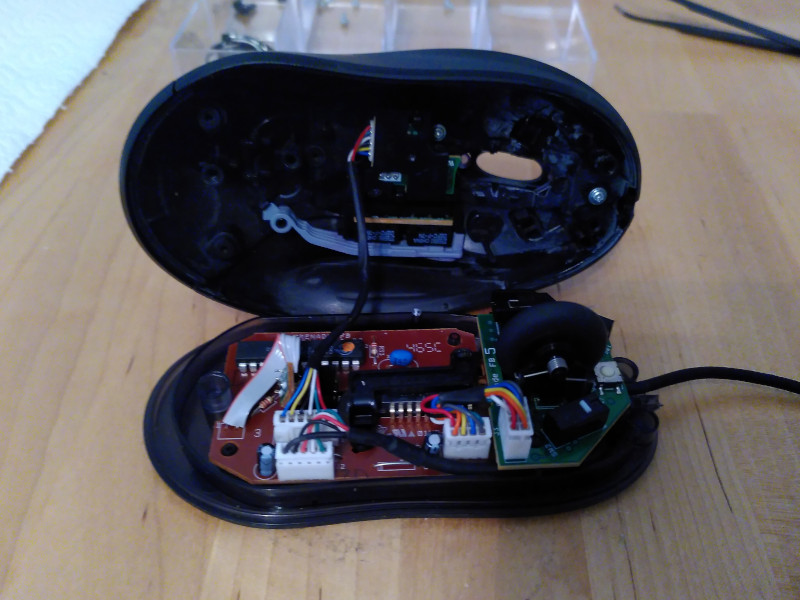
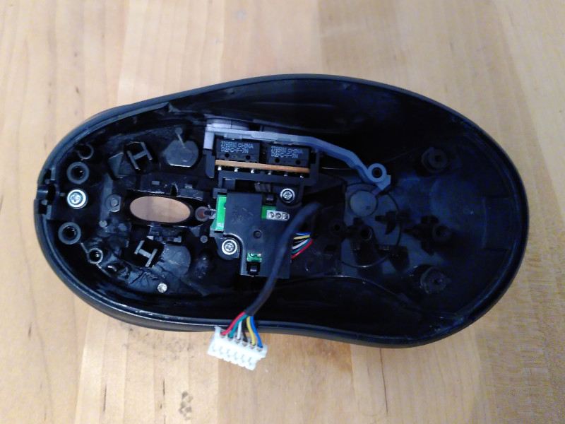
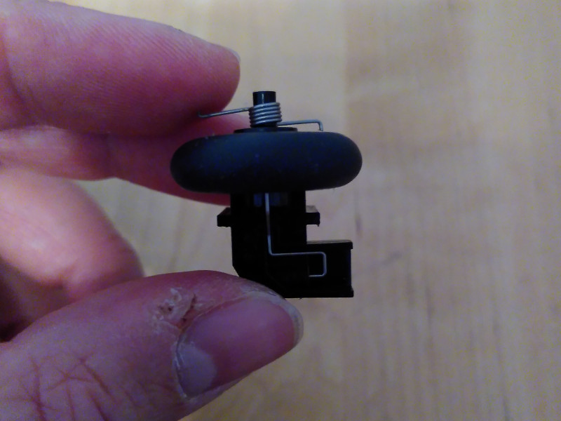
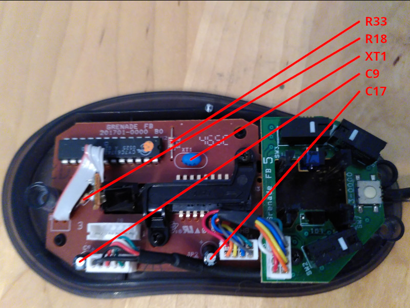

===
- date: 2024-11-01
- name: MX-518 Repair Guide
- tags: computer, modding
- type: hardware, legacy
- crux: Repair Guide for the best mouse ever produced, the Logitech MX-518
===


This repair guide describes the disassembly of the Logitech MX-518, its parts
that usually break down, and how to replace them.

Over the weekend I decided that I want to have a Logitech MX-518 again, because
I'm not really satisfied with my Vertical Mouse when it comes to its ergonomics.

So I kind of went back to the roots, and bought a broken MX-518 for 10EUR off
eBay and thought it would be a nice task to restore the mouse's internals, clean
it, and put it back together.


## Parts List

- Broken MX-518 with flaky USB cable and burnt resistors
- Replacement USB cable from eBay that fits on the PCB
- PH0 (Philips size 0) screw driver
- (Optional) Replacement resistors


## Teardown



Remove the 3 screws on the bottom of the mouse and gently remove the mouse shell
from the bottom part of the mouse.

Inside you'll see essentially two parts:

- The top shell containing the click switches for the side buttons
- The bottom shell with the PCB containing the mousewheel and all other switches


## Top Shell



Then it's time to take apart the top shell and to clean the buttons and switches on the inside.
After that you can remove the daughter PCB board with its two screws in the middle.

The side buttons of the MX518 have have a grey connected plastic bar on the inside that needs to
be rotated counter clockwise (note the right part) before you can remove it.

There's also two screws on the inside that you need to remove before you can take apart the
top cover part, make sure to gently remove it and don't use too much force because the left and
right side of the cover are a little bigger than the openings.


## Mouse Wheel

Clean the mousewheel thoroughly, it probably contains lots of dirt. The mouse wheel
itself is put together with a spring that pushes it back to the top.

Here's a picture for reference on how to put it together, because the mouse wheel
spring tends to fly off when you remove it from the bottom shell.




## Electronic Components

In my case, the MX518 had the typical resistor breakdown because it was short-circuited
by the flaky USB cable. This seems to be happening a lot with the first-generation model
of the MX518.

The PCB is quite straightforward and easy to solder on. In my case I needed to replace
the R33 resistor (the one on the top) because the USB cable likely connected the 5V to
CLK.

There's not many components on the PCB that could break over time. Apart from the two
intentional short circuit jumpers `J1` and `J2`, these are the components that might
break over time:

- `C9`: (capacitor) SS 85 deg Celcius, 5091 (M)
- `C17`: (capacitor) 16V 10 muF
- `XT1`: (ceramic resonator) 240
- `R33`: (resistor) red purple red gold
- `R31`: (resistor) red purple red gold
- `R18`: (resistor) red purple red gold

Here's a picture for reference that contains the components that can be replaced:




## Resistors

I'm mentioning this here because it might not be clear to readers without an electronics
background. The color coding of the resistors is a schematic that allows to describe the
resistance value (units in `Ohm`) and the tolerance suffix (`+/- percentage`).

In our case the resistors on the PCB always uses the same color coding, so they're the
same component with `2700 Ohm +/- 5% tolerance`.

```table
Number | Number | Multiplier | Tolerance
red    | purple | red        | gold
2      | 7      | x100 Ohm   | +/- 5% tolerance
```

As an electronics engineer, you learn to remember the order of the colors, as that's all
you need to decode it later: `Black Brown Red Orange Yellow Green Blue Purple Gray White`

```table
Color  | Meaning as Number | Meaning as Multiplier | Meaning as Tolerance
Silver | (none)            | x0.01                 | 10%
Gold   | (none)            | x0.1                  | 5%
Black  | 0                 | x1                    | (none)
Brown  | 1                 | x10                   | 1%
Red    | 2                 | x100                  | 2%
Orange | 3                 | x1000                 | 0.05%
Yellow | 4                 | x10000                | 0.02%
Green  | 5                 | x100000               | 0.5%
Blue   | 6                 | x1000000              | 0.25%
Purple | 7                 | x10000000             | 0.1%
Gray   | 8                 | x100000000            | 0.01%
White  | 9                 | x1000000000           | (none)
```

