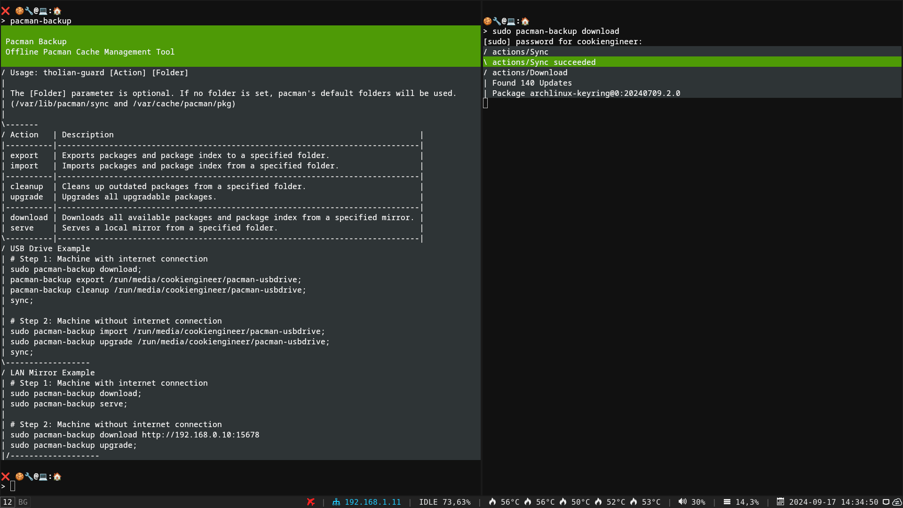

===
- date: 2024-09-01
- name: Pacman Backup
- tags: pacman, archlinux, networking
- type: software, legacy
- crux: Share and reuse pacman updates offline via USB drives or mesh networks to save network bandwidth.
===


This is somewhat a release blog entry about Pacman Backup. This article somewhat
documents the usage scenarios and why I've decided to refactor an older implementation.

A couple weeks ago someone from Cuba contacted me and told me about problems and issues
with the old version of the tool, and I finally got the time to refactor it and fix the
outstanding bugs and limitations. As it turns out, Cuba's Sneakernet uses `pacman-backup`
to share and install ArchLinux on their machines, which is kind of awesome to hear about.




## Pacman Backup

[GitHub Repository](https://github.com/cookiengineer/pacman-backup) and [GitLab Mirror](https://gitlab.com/cookiengineer/pacman-backup)

Pacman-Backup is a CLI tool that allows to download available packages on one machine, and
to transfer the packages via USB drives or via a locally running pacman mirror server to
another machine that's airgapped and doesn't have direct access to the internet.

The old version (written in `nodejs`) of Pacman Backup had some bugs and limits in what it
could do, the new version (rewritten in `go`) provides much tighter integration with `pacman`'s
configuration files that resolves those issues.

The new version was rewritten in `go` so that it has no dependencies and doesn't rely on
having to have the same system with the same `glibc` dependent library versions installed.
This way the tool itself can also be shared in a portable manner via USB drives, and doesn't
need to be recompiled and neither to be redownload or reinstalled.


## How it works

The rewrite of `pacman-bacup` generates a temporary `/tmp/pacman-backup.conf` file that
can be used by `pacman` with the `--config` flag. This way it guarantees interoperability
with update constraints, like `HoldPkg` (stickied packages) or `IgnorePkg` (ignored packages)
options in the local `/etc/pacman.conf` file.

The temporary config file changes essentially the `DBPath` and `CacheDir` options and points
those to the mounted target folder on the USB drive.

Pacman-backup also parses pacman's output of `-Si`, `-Qi`, and `-Qip` to find out what packages
need to be downloaded and what packages are available already in the local package cache.

Another optimization that `pacman-backup` offers is `pacman-backup cleanup`, which allows
to manage the limited memory on a USB drive in a better way. The cleanup action preserves
only the latest version of each package, while also respecting to keep stickied or ignored
packages.


## Usage Examples

### Pacman Updates via USB Drive

On the machine with internet connection, do the following:

1. Insert and mount the USB drive.
2. Download the packages to the USB drive.
3. Cleanup the package cache on the USB drive.

```bash
pacman-backup download /run/media/$USER/usb-drive;
pacman-backup cleanup /run/media/$USER/usb-drive;
sync;
```

On the machine without internet connection, do the following:

1. Insert and mount the USB drive.
2. Upgrade packages from the cache on the USB drive.

```bash
sudo pacman-backup upgrade /run/media/$USER/usb-drive;
```


### Pacman Updates via Meshnet LAN or Wi-Fi

On the machine with internet connection, do the following:

1. Download all updateable packages.
2. Serve a local pacman mirror server.

```bash
sudo pacman-backup download;
pacman-backup serve;
```

On the machine without internet connection, do the following:

1. Download updates from the local pacman mirror server.
2. Upgrade packages from the cache on the local hard drive.

```bash
sudo pacman-backup download http://192.168.0.10:15678/;
sudo pacman-backup upgrade;
```


## Downloads

If you have a censored internet connection and cannot access `GitHub` or `GitLab`,
you can also try to use the known mirrors of my website and/or the direct downloads
here: [Download source of pacman-backup](/projects/pacman-backup/pacman-backup-2.0.1.zip)

You'll need `go` version `1.23 or later` to build `pacman-backup`, the project has zero dependencies.

The old node.js version can be downloaded in the [Projects Overview](/projects.html#open-source-pacman-backup).

