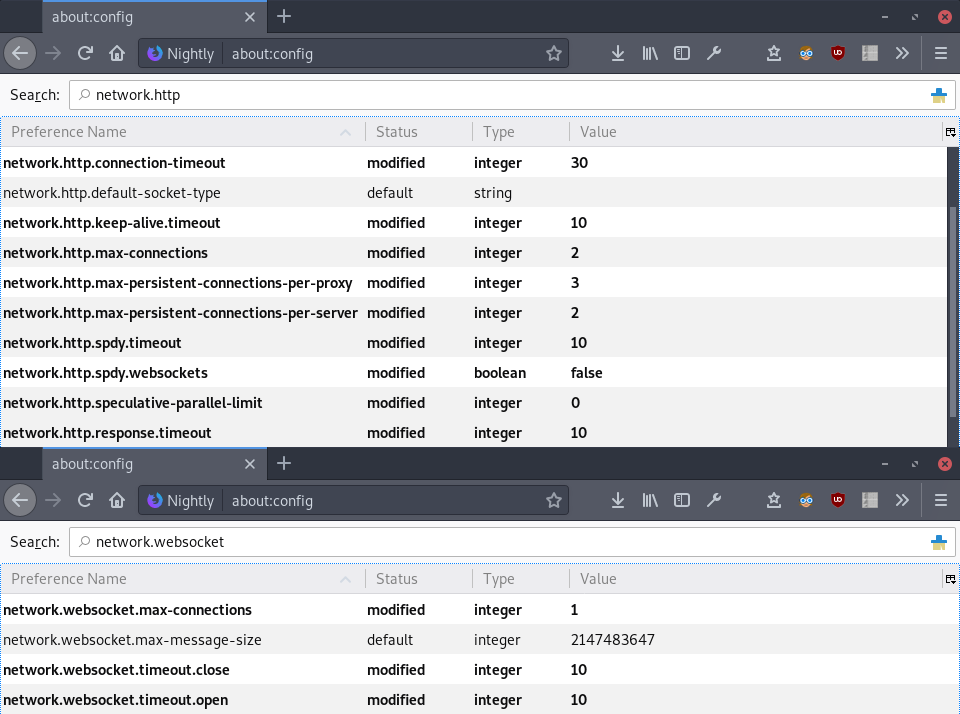
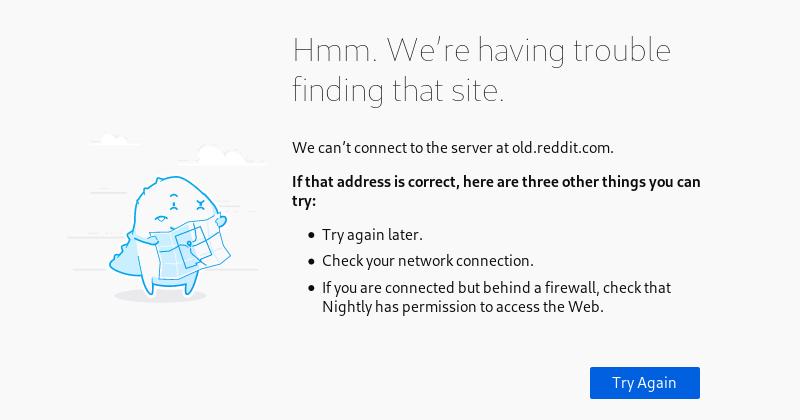
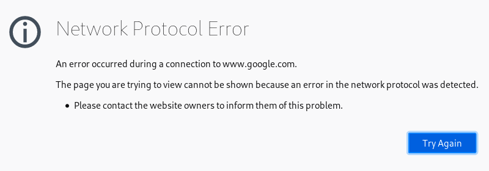
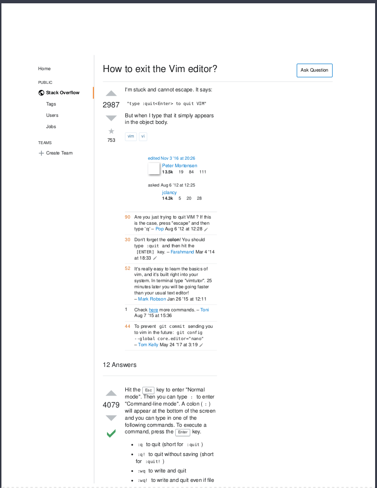
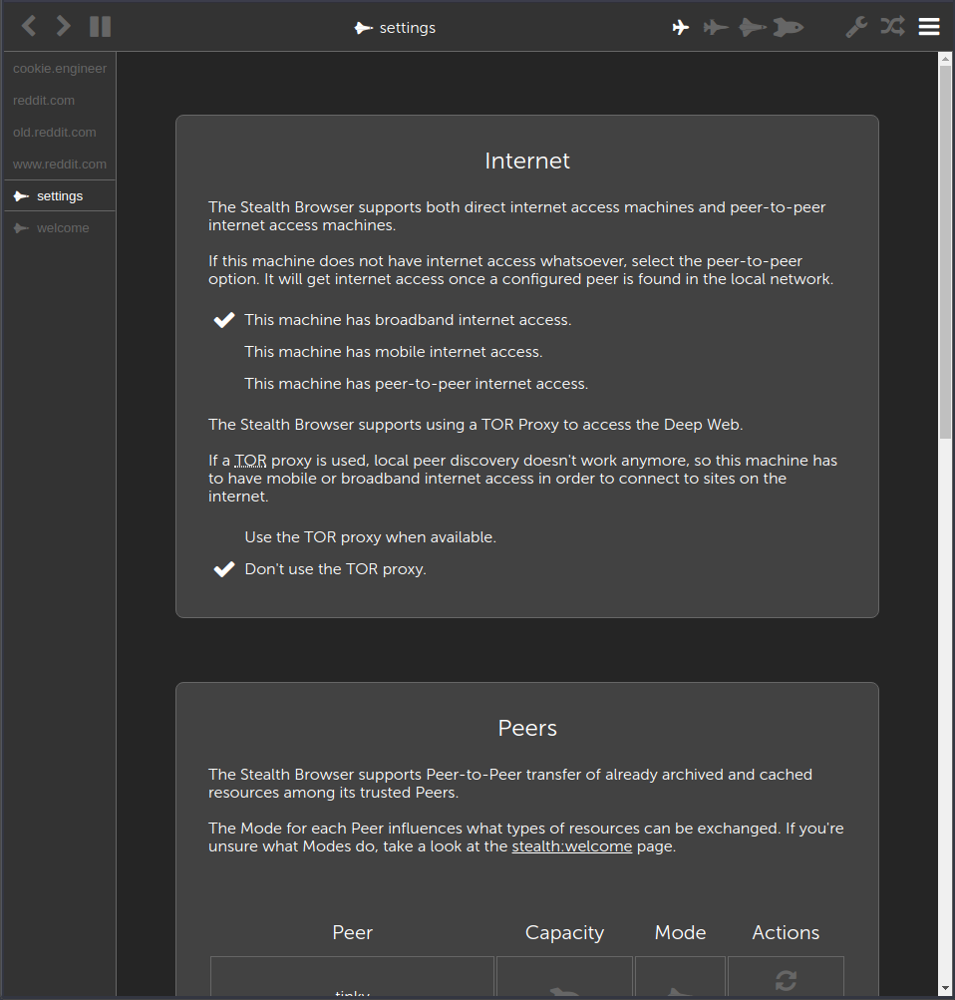

===
- date: 2019-01-15
- name: Problems with Web Browsers
- tags: networking, privacy, security
- type: software, research
- crux: The evolution of the Web, its problems and a masterplan on how to improve it by building my own Web Browser.
===

This weekend I finally decided to start to build my own web browser.

Actually I've thought about it for quite a while, because I really
don't agree where the Web and how it is used is going. Due to my work
of being a software engineer, most of the time I do browse the web
in order to find articles, read articles and papers about topics,
and discussions of problems on reddit and stackoverflow.

That's it, quite literally that's what I use the web browser for
over 90% of the time. I don't regularly use social networks much
(only max once per week, probably even less) because I think they
are a waste of my precious time.

But when I do, I always use their mobile variants instead of the
"real" ones. So I'm using `m.facebook.com` or `mobile.twitter.com`,
for example - because the normal websites are so much pain to use
and they annoy me most of the time with all their ads and useless
scripts that prevent me from efficiently consuming their content.


## Web Extensions

In the beginning of last year - in 2018 - I decided to give the
Firefox Quantum release a go. Before that I was using
[Ungoogled Chromium](https://github.com/Eloston/ungoogled-chromium)
most of the time.

I realized that Chromium is very limited when it comes to the
interception of requests and modifying the network flow, so
by concept most of the Web Extensions cannot protect you from
advertisement networks.

As the default behaviour on what a Web Browser does is literally
the most optimistic case (in everything they implemented over
the last decades, they never learn) I am forced to use Web Extensions.

The Web Extensions that make the interwebz somewhat usable are:

[HTTPS Everywhere](https://github.com/EFForg/https-everywhere)
because Browsers are idiots. Period. This extension does nothing
else than replacing `http://` with `https://` in every URL that
the user types in. I think Web Browsers should've done that a
long time ago.

[uBlock Origin](https://github.com/gorhill/uBlock) because it
allows to filter advertisements by using community-maintained
filter lists.

uBlock Origin by default has support for host block lists and
adblock-filter rules (that are applied to the DOM after it was
loaded, not before) to block elements and scripts via a selector.
These are community-maintained, but they are of very good quality.

The issue is that a Browser Extension cannot modify the loaded HTML,
and can only modify the parsed DOM. So that's why there exists an
Anti-Anti-Anti-Adblocker somewhere already.

[uMatrix](https://github.com/gorhill/uMatrix) to make uBlock Origin
usable. Most of the time, I block everything except whitelisted,
trusted websites that I visit regularly.

This is actually a problem of the naive Web Browser that allows iframes,
tracking cookies, advertisement networks and WebRTC-abusing network
traces by default. uMatrix allows to flexibly set that with a clickable
matrix instead of some weird filter rule syntax nobody that's not a
developer can understand. Even though, the matrix isn't understandable
at first, so you have to adapt your thinking to that as well.

[Decentraleyes](https://github.com/Synzvato/decentraleyes) to fix
cache-busting CDNs. Most CDNs on the web actually abuse cache-busting
in order to track their users.

That means they do not use correct `ETag` or `Last-Modified-Since`
flows and let the Browser always do a completely new request for the
identical assets that have not changed for years. The extension has a
very limited understanding of what is an asset, as there's no API for
that in any kind of Web Browser...so most of the time it's actually
still loading stuff from `redditstatic.com`.

[Cookie Autodelete](https://github.com/Cookie-AutoDelete/Cookie-AutoDelete)
to delete cookies that I do not want websites to store. It allows
whitelisting websites, so only trusted websites can store login data,
sessions, or tracking cookies.


## Mobile Internet

Okay, now let's talk straight about the situations you cannot change.
In Europe Internet Service Providers are ridiculously expensive, they
are even more expensive when it comes to providing mobile internet.

Additionally, there was no legal way to provide free Wi-Fi without
the owner of the router being responsible for what a script kiddie
does on its internet connection.

The initiative of [freifunk](https://freifunk.net) fought a 3-years-long
legal battle in front of the state to get the right to provide a
free internet connection for everyone by abusing a loophole that ISPs
are not responsible for their users; and that freifunk as a legal
club (*e.V.* aka *eingetragener Verein*) now is officially being
treated as an Internet Service Provider. This process took very, very
long, and odds are very much against you that you can be your own
ISP. So there's not much of a free Wi-Fi that's not coming with
injected ads and TLS certificates provided by the money-making
machine.

So, when talking about high-speed mobile internet, the `flat rates`
for mobile are actually no flat rates. They are always limited with
a volume. Once you exceed that volume (I do that on the first day
of the month within less than two hours, always), you are very much
back to the 1960s with your very unstable `4 kibi Bytes` per second.

When an internet connection is throttled, the Domain Name System
protocol will be compromised as well. That is not only the case
with throttled internet connections, but with all mobile connections,
always, even while you feed the dragon hundreds of bucks a month
to keep your `5 Giga Bytes` for the next 30 days.

They do so by setting the TTL (time to live) header field to
`0 seconds` in order to let the Web Browser forget the IP of the
domain you've just requested.

So the network flow will always look like this.

```chat
Browser:  What is the IP of "reddit.com"?
Internet: Hey, it's "1.2.3.4"!
Browser:  Okay, gonna do a request to "1.2.3.4" now.
Browser:  Oh, found a CSS file.
Browser:  What is the IP of "reddit.com" again?
Internet: Hey, it's "1.2.3.4"!
Browser:  Okay, now loading the second CSS file.
Browser:  What is the IP of "reddit.com" again?
Internet: Hey, it's "1.2.3.4"!

(... and so on ...)
```

... and it will continue to do so with - every - single - request.

Additionally, every request that is done - ever - will receive
data after an initial `30 seconds response timeout`. And every
mobile connection has a maximum of `4 parallel sockets` whereas
all other sockets are timing out after `2 minutes` when more
than one socket exceeds the bandwidth limit.

As there is no easy way to do this in a Web Browser (it's only
configurable anyhow in Firefox's `about:config` with around
20 different options for each protocol and situation) the
underlying problem is that when switching a connection it
takes at least 10 minutes until you have configured everything
correctly.



The screenshot is somewhat cropped together, because there's
no easy way to do these mobile internet settings in a single
search and/or all together. I probably forgot one of the
dozens of entries I had to override to make it work, and I'm
sorry about that... but it's literally totally undocumented
and you will only know about its perks and tweaks when you
are faced with yet another useless error message.

Also, you cannot use Chromium because Chromium keeps doing
shitty requests to `clients1.google.com` that you have to
blacklist in your `/etc/hosts` file. Otherwise you will
have to wait for your Web Extensions to update, all the
fucking time. And a couple of Mega Bytes should not be
underestimated at `4 Kibi Bytes`, on failed requests it
will continue back from scratch, because google's
download servers do not have `Content-Range` or `bytes=`
range requests support.

It's so annoying that I actually forked and rewrote a [DNS Proxy](https://github.com/cookiengineer/dns-proxy)
that tried to fix at least parts of it and that maintains its
own hosts file, but soon enough I came to realize that a DNS cache
without the *why* it was loaded is pretty senseless and stupid
and will waste a lot of traffic anyways. Let alone the UX problem
of telling a user to override a specific host with `127.0.0.1`
in order to be able to use Chromium with it.

There is no such thing as a working DNS filter aand cache without
the *why* it was loaded. The why decides what to refresh, when to
refresh and how to refresh. Otherwise it won't work. Literally,
never ever. If dev ops guys say differently, they ain't knowing
shit about what they talk.

So in my personal opinion, the DNS cache has to be maintained by the
Web Browser in an intelligent and peer-to-peer manner.


### TCP Connections

Additionally, when using a mobile internet connection, TCP
(*Transmission Control Protocol*) is broken as well. When you try to use
something like a `Sweden VPN` in order to get your neutral internet
connection back, Internet Service Providers will fuck that up as well.

Every TCP connection to a bordering country will be flagged for manual
intervention by the feds (I know that for sure, as I've seen Gotham
and the systems behind it). Additionally, the Internet Service Provider
will slow that bandwidth down as much as possible by injecting TCP
RST (*Rest*) packets.

Those packets will be packets without content, they are just literally
telling the client something like "Hold on, I need more time".
These packets are injected to slow down the connection, as it's not
possible to request anything else on this socket until it times out.
Well, and they set the timeout to the maximum limit possible.

If you don't believe me, try typing via Remote SSH on a Sweden VPS.
It's so annoying that you will smash your keyboard after a couple
minutes. If you ask the Internet Service Providers about why it's that
way, nobody knows anything. They will always deny it. But when using
a DSL connection of the very same Internet Service Provider, it will
magically work.


### UDP Connections

Most people in the South American area are using the UDP Tunnel idea
in order to get back their uncensored internet. As ISPs there are
flagging and slowing down TCP connections as well, their solution to
the problem is using a UDP socket via mobile internet connection.

As Internet Service Providers are always allowing UDP (because it's
their means of how to track their users) there'll always be an
unlimited UDP socket on `port 53`. Literally, this is how you can
get unlimited internet bandwidth on mobile, and how to break out
of your throttled internet. BTW it works in Europe, too.

The downside is that most internet connections will become very,
very unstable. As packet loss is killer for UDP, you will have at
least 20% unsuccessful HTTP requests and/or TLS protocol errors
inside the Web Browser. So that's no practical solution, at least
not with the current state of Web Browsers.


### Socket Timeouts

Networking on mobile internet connections are always unstable, so
you have to assume that a socket isn't for granted and that when
a response doesn't come within time you can assume it didn't work.

Most concepts on how this part is implemented currently has a fixed
value in the sense that a static timeout is set and assumed to work
in every future case.

That is not the case on mobile internet connections, as there might
be stable connections temporarily, but not always. It's a time-dependent
problem, so it must be dynamically adapted, and not statically set.

All Web Browsers and all networking stacks that I know of do that
particularly wrong, so most of the time you as a user keep waiting
for literally 10 minutes before you can open a new socket again,
and then the Web Browser realizes "Oh shit, I can actually do a request".

Before the socket times out, you cannot do so. If a single request
to a website or asset and script failed, you end up with waiting
time. You cannot even influence this by resetting your Wi-Fi or
whatever network interface. Literally, this is annoying as fuck
and there's no solution to the problem in current Web Browsers.

Also, waiting for 10 minutes isn't enough. After that you will
have to reload the whole page again, so the Browser Cache will
be flushed and you start from scratch. When being online on
EDGE/2G only, a website will successfully download around 20%
of the time. And quite literally, when the Browser loads web
advertisements, it gets exponentially worse.


## Error Handling

The Web Browser is a little retard. Every time an error happens
it assumes that the user magically knows what to do when it
shows an error message.

The simplification of those error pages by telling "Could not connect
to the website" doesn't magically make it work, dear Web Browser
designers. A little dinosaur won't make it work either.



In these error cases that happen very often when being online on
mobile, most of the time it is solved by doing another request
and then packet loss is temporarily less than before and it will
work again. But, as Web Browsers are retards, they will redirect
the *whole fucking tab* to the error page when a sub-request
anywhere on the website or its requested assets or scripts failed.

If it can't load the advertisement networks' cookie notification
for European users, it will literally black out the whole Tab
and show nothing; forcing the user to reload the whole website
again. And requesting again is bad, because Web Browser caches
are little retards, too.




## Web Browser Cache

Okay, now it's getting very hard to stay objective here. Literally,
this is the most frustrating part ever when it comes to talking
about Web Browsers and how they work.

Every time there's a Web Browser cache issue the Web Browser devs
delegate the problem to the developer's side, saying that they
are implementing HTTP/HTTPS/whatever wrong and send the wrong
response headers to some special requests that they introduced.

For a while there was the `Cache Manifest` specification, but as
every Web Browser ignored that quite literally, the W3C gave up
on that, too.

So, when it comes to Browser Cache, the Browser always relies on
the correct implementation of the complete HTTP specification.
If there's one of possibly thousands of mistakes in there, it
won't work. Literally that is why the Web Browser always does
requests to `something-static.net` and why static CDNs are not
really static, actually.

Current Browsers always assume the Best Case Scenario here without
any kind of graceful implementations and intelligent algorithms
here, which is very bad. Never trust a website developer to be
an all-knowing godlike being. Never, ever. It's simply impossible
to know everything regarding Web Browser APIs.

The Web Extension *Decentraleyes* somehow tries to fix that, but
whitelisting the internet with a delay of two weeks until it's
available for end-users again isn't really how it's supposed to
be possible at all.

So when talking about working Browser Cache...

I'm using `old.reddit.com` as I don't agree with the annoying
JavaScript-based overlays on the new website. The code of all
assets regarding `old.reddit.com` didn't change for over two years
now, and yet the Web Browser keeps requesting stuff from
`redditstatic.com`. How's that even possible?


In the screenshot you'll see only the filtered website already
(without any advertisements or API requests that are not necessary
to display the web page). All of the assets and scripts were
downloaded before and should've been in the Web Browser Cache.

Literally, all requests except the initial HTML file did not
change for years. And those 4 minutes waiting time will happen
on every single link that I will click, even on the same website.

Even when assuming that web developers always know the correct
implementation of HTTP/HTTPS headers and what you as a Web Browser
are assuming (they can't know because there are no docs on that,
actually. You have to read the browser's code base which is
literally beyond `20 Giga Bytes` in size these days) you still
could handle it more intelligently than that.

For example, make a statistic of how often this very specific
URL was requested because missing headers said so, and just `+1`
that rank every time it is requested. After a million requests
without a change in `Content-Length`, it will be blacklisted and
not requested anymore. I bet even this stupid algorithm would be
more efficient than how both Firefox and Chromium work these days.


## Web Browser APIs

I realize that the Web Browsers got a bit awesome, too. Being
able to create fancy WebGL games, rendering a lot of effects,
animating the shit out of that transforms and having dynamic
web chats is indeed very awesome.

But, with great power comes great responsibility.

And you cannot do so by default. If advertisement networks start
to track their users via ultrasonic sound that's playing on
a website in the background, leaking their private network
information via WebRTC turtle routers that they own, creating
an all-recording speech-to-text protocol of what the user
said during the visit of their website while he's been on an
Android App that loaded the very same advertisements of the
very same advertisement network, leaking even GPS and IMEI
information ... is not what I think is a responsible thing to
allow as a Web Browser developer.

This is the golden age of spy agencies. Think about it, back
during the Nazi regime they had to hire people and physical
neighbors to listen to your dirty secrets. These days they
have that for free, because Web Browser devs don't give a shit
about their users.

I personally cannot stress enough how important the right
to privacy and the right to disallow self-incrimination
is. It is the foundation of what I believe in and what I
think societies should embrace, no matter on which planet
or country they are.

I also cannot stress enough how wrong it is to allow all
those Web API features by default and removing the power
of decision from the user and moving it to the website
owners and financially motivated corporations.

If somebody was listening to you with a microphone on the
street, all the time pushing the mic right into your face
and trying to sell you online casino-related shit you don't
need and taking notes when you kiss your girlfriend... would
you tolerate it?

Probably not.

Why are you tolerating it in the Web then? I mean, come on.
You gotta have to wonder how Google and Palantir get their
data at some point. They are "free" as in "self-prostitution"
for a reason.

This has to change. And if Web Browser devs aren't willing
to listen, I have to change it myself.


## The Semantic Web

The Semantic Web was an idea, and it kind of never made
it into the real world. But I really admired the idea
and I think it's important to know about it when talking
about the *Why* of Web Browser behaviour.

Back in the days when I learned HTML, CSS and JavaScript,
things weren't so dynamic and more of static nature.

The general idea was to embrace HTML for content, CSS
for design and JavaScript for behaviour in order to
make websites accessible for people that cannot read or
see the same way as you do.

I'm also talking about blind people here, these use
"Web Browsers" like JAWS or similar which include
screen readers and can navigate through elements and
paragraphs with short cuts. Some of them also have braille
integration, so that they can read it with their finger
tips.

But, as most screen readers use trident 6.0, it's based
on a very outdated Internet Explorer that can't do shit
and won't understand shit about shit.

The major problem I have with HTML5 is that Web Browsers
at some point decided that XHTML was not worth going for
because of the lack of "forgiving mistakes in parsing".

Remember when Opera had a weird XML parser message with
the yellow background and red colored text everywhere?
That's what I'm talking about.

When a website developer didn't know their stuff about
creating a validating XHTML website, these kind of
parser errors happened.

So, XForms and related specifications embracing easily
parseable XML-like structures was dropped and SGML-like
structures was the way to go now. Also known as living
standard and HTML5 where you have to do redundant shit
and polyfills all the time. But that's not the point
and I'm ignoring it here.

Personally, I liked the idea about the Semantic Web
because it created relational data and meaning of
content. The content was completely parseable and
"polishable" in an automated manner. Web Browsers
could literally understand the content, even before
the age of Reinforcement NLP AIs that are still not
quite there yet.

The advantages of embracing the Semantic Web are
unimaginable. Things like "Wanna print the website
and store it in your bookshelf? No problem." or
"Wanna summarize the page real quick for me?"
would have been for free.


## The Knowledge Web

But sadly, HTML5 doesn't give shit about shit. These
days literally not even stackoverflow can be printed
out and even has no print stylesheets. A website that
has the only purpose of transfering knowledge.

What the fuck?



When I got online, the first website I visited was
[MIT OpenCourseWare](https://ocw.mit.edu/index.htm).

I was 12 at the time, and I downloaded literally
everything interesting I could find. The next month,
our internet plan (which had *5 Giga Bytes* volume)
was overdue by *20 Giga Bytes*.

My parents were not so happy, and actually tried to
block me from accessing the internet but realized it
was a bad idea when I hacked the computer at the city's
library in order to access to MIT OpenCourseWare.

Yes, the police incriminated me for that and yes, I
was processed. Thanks, society.

It literally still gives me the chills when I think
about MIT OpenCourseWare or the [Internet Archive](https://archive.org).

These people are the good guys. Free knowledge. All
knowledge. All ideas that humanity had ever. Literally
at my fingertips. I only have to ask the correct question
and learn *How to Ask*.

From building an indoor cleaning robot to building a
space rocket. Everything's there. How amazing is that?


## The Back To Reality Web

Sadly, Web Browsers ignore that very factor completely.
When I visited a website and I'm offline afterwards,
I cannot access that knowledge anymore. I can't find
shit using the search in the address bar, and I cannot
even find my goddamn bookmarked websites.

I probably have been to the exact same article on
stackoverflow about the exact same problem and solution
hundreds of times. I even bookmarked it, yet I can only
access it by searching for it again on Google.

What the fuck?

I think this can be done better. I wish that the Web Browser
had an automated integration for `404 Not Found` errors
on the Web.

For example, why not query the Internet Archive with the URL?
If it's there, offer the possibility for the user to download
the latest archived version of the website.

Well, or just correctly cache it in the first place.


## Tholian Stealth

All in all I probably forgot about dozens of annoyances
on why I started to create my own Web Browser.

The Too Long Didn't Read version of this article is probably
I think Web Browsers do suck and they do it wrong, and
I want to make the internet semantic and awesome again.

So I started to implement my own peer-to-peer Web Browser
under the name [Tholian Stealth](https://github.com/tholian-network/stealth)
and it's not even working yet.

The planned architecture filters out all stuff that a
website doesn't need to make it readable, so it will also
probably drop support for JavaScript entirely and filter
that out as well.



The idea is to have a peer-to-peer knowledge-aware
Web Browser that can and will share resources among
other machines in the local network, allowing an
intelligent offline cache that will lead to less
bandwidth usage and will allow to search the local
web archive when you need answers to the same question
on stackoverflow again.

It will also be a Web Browser that drops support for
JavaScript, Cookies and everything entirely by design.
It tries to bring back the Semantic Web and filter out
all things you don't need to understand the content of
the website.

Things like JavaScript, WebGL, WebRTC or Web Fonts are
completely filtered out on purpose to speed up the download
process. The idea is to do that on HTML-level, so that
the cached files do not have to be post-processed and
can be reused later in an offline manner.

There's simply no way to filter out all that crap that
advertisement networks will do to abuse Web APIs, so
things like Web Logins, sessions, commenting and everything
that came after the Web 2.0 hype will probably only be
realized by trusted plugins that will use the website's
API instead of using their JavaScript files.

At least, that's the plan for now.

The project is in its very infancy, so there's not much
to see yet. I'm probably going to write an article
about it once it's ready for the public.

If you have feedback, critiques or comments about the
architecture or design, please let me know in the
[issues](https://github.com/tholian-network/stealth/issues)
of the project.

