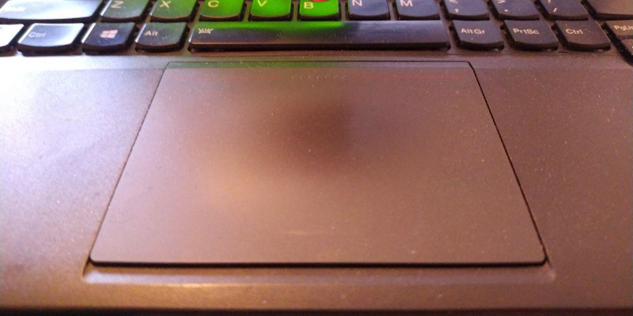

===
- date: 2020-04-01
- name: Synaptics Touchpad on Linux
- tags: linux
- type: software, legacy
- crux: A How-To Configuration Guide for the legacy xf86-input-synaptics drivers on GNU/Linux systems.
===




So you've landed here, and I feel you. You run Linux or BSD on an outdated
machine with an outdated piece of Touchpad that just won't work properly.
Every stackoverflow answer is wrong and doesn't work, you're stuck, and you
have no idea how to fix it.

But don't give up, this guide is meant exactly for you to learn about the
inner workings of the Synaptics Touchpad driver and how to actually make
it work without issues. Because it's actually a sophisticated device that
just needs some configuration love in order to make it enjoyable to use.


### Configure Xorg/X11 Synaptics Driver

On your Linux or BSD distribution, you'll have to add a configuration file
for the `synaptics` driver. For ArchLinux, this file has to be stored at
the path `/etc/X11/xorg.conf.d/70-synaptics.conf`.

In order to get started, there are some quirks here. The newer driver
`libinput` replaced the Synaptics driver, we all are aware of that. But
that also means that the Synaptics driver needs to catch all events from
the legacy `/dev/input/event*` events from the Linux kernel.

Additionally the Driver has to ignore emulated Mouse pointers coming from
the Touchpad, otherwise we'll end up with a messed up behaviour that will
shift the Mouse relatively instead of absolutely to the Touchpad corners.

In the `70-synaptics.conf`, we start with the following:

```config
Section "InputClass"
	Identifier "touchpad catchall"
	Driver "synaptics"
	MatchIsTouchpad "on"
	MatchDevicePath "/dev/input/event*"
EndSection

Section "InputClass"
	Identifier "touchpad ignore duplicates"
	MatchIsTouchpad "on"
	MatchOS "Linux"
	MatchDevicePath "/dev/input/mouse*"
	Option "Ignore" "on"
EndSection

(...)
```


### List available Synaptics Driver Options and Parameters

If you're using the Synaptics Touchpad driver already, you'll also have the
`synclient` tool available that you can use to show all settings and further
parameters to configure the touchpad driver's Xorg config files.

```bash
[$] synclient -l;

Parameter settings:
    LeftEdge     = 1310
    RightEdge    = 4826
    TopEdge      = 2220
    BottomEdge   = 4636
    (...)
```


### Use Edges for Scrolling with the Synaptics Touchpad

The Boundaries are easily defined once you understood that there are two
independent areas that you can define.

- The `*Edge` Options are related to Edge-based Scrolling.
- The `Area*Edge` Options are related to Touches and Two-Finger Scrolling.

If the Touch Area exceeds the Edges, it's recognized as a Touch and not an
Edge Tap. So if Edge-based Scrolling is desired, the Edges of the Touch Area
are not allowed to exceed the `*Edge` Edges.

Example for an Edge-based Scrolling Area that has two separate Scrolling
Areas on the Right (for vertical One-Finger scrolling) and Top (for
horizontal One-Finger scrolling):

When running `synclient -l`, the defaulted areas give a hint on how large
the coordinate system of the installed Synaptics Touchpad is. In the
example case, it's `5112` in X-direction and `4832` in Y-direction.

```config
# Inside /etc/X11/xorg.conf.d/70-synaptics.conf

Section "InputClass"
	MatchDriver "synaptics"

	# Outer Area (for Edge Scrolling)
	Option "LeftEdge" "0"
	Option "RightEdge" "4826"
	Option "TopEdge" "2220"
	Option "BottomEdge" "4832"

	# Enable Edge Scrolling
	Option "VertEdgeScroll" "1"
	Option "HorizEdgeScroll" "1"

EndSection
```


### Use only Touches and Gestures with the Synaptics Touchpad

As mentioned in the previous paragraph, the Synaptics Touchpad differs
between the `*Edge` Options that define the older Edge One-Finger based
Scrolling, and the newer `Area*Edge` Options that can optionally be
combined with the nwere Two-Finger based Scrolling.

The `Area` Options define the Touch/Tap areas on the Touchpad, so that it's
possible to just instead use Two-Finger Taps and Two-Finger Scrolling and/or
Three-Finger Swipes and Middle Clicks.

When running `synclient -l`, the defaulted areas give a hint on how large
the coordinate system of the installed Synaptics Touchpad is. In the
example case, it's `5112` in X-direction and `4832` in Y-direction.

```config
# Inside /etc/X11/xorg.conf.d/70-synaptics.conf

Section "InputClass"
	MatchDriver "synaptics"

	# Outer Area (for Edge Scrolling)
	Option "LeftEdge" "0"
	Option "RightEdge" "5112"
	Option "TopEdge" "0"
	Option "BottomEdge" "4832"

	# Disable Edge Scrolling
	Option "VertEdgeScroll" "0"
	Option "HorizEdgeScroll" "0"

	# Inner Area (for Touches and Taps)
	Option "AreaLeftEdge" "0"
	Option "AreaRightEdge" "5112"
	Option "AreaTopEdge" "0"
	Option "AreaBottomEdge" "4832"

EndSection
```


### Detect Taps and Detect Resting Hand Palms

By default, the Tap Buttons of the Synaptics Touchpad driver are messed up,
and you probably want to change the Options related to them in order to have
a correctly working `Two-Finger Rightclick` and `Three-Finger Swipe`.

If the Laptop has also a `Clickpad` (e.g. like Thinkpads have) it's
also possible to disable it via the `Clickpad` Option. The `PalmDetect`
Option is there to have you covered during typing on the Keyboard.

As every Hand Palm is different in size and weight, there's also a possibility
to tweak the detection of it. If your Hand isn't detected properly or sometimes
positions the mouse cursor or taps accidentially, the `PalmMinWidth` and `PalmMinZ`
(pressure) Options can be tweaked.

Note that even the old Thinkpad Touchpads in the `T400` series had support
for Pressure-based motions in Z-direction, so it's very likely that later
models of Laptops support it, too.

```config
# Inside /etc/X11/xorg.conf.d/70-synaptics.conf

Section "InputClass"
	MatchDriver "synaptics"

	# Disable annoying Clickpad on Thinkpad Touchpad
	Option "Clickpad" "0"

	# Palm Detection
	Option "PalmDetect" "1"
	Option "PalmMinWidth" "10"
	Option "PalmMinZ" "200"

	# Expected Tap Button Behaviours
	Option "TouchpadOff" "0"
	Option "TapButton1" "1" # One-Finger Left Click
	Option "TapButton2" "3" # Two-Finger Right Click
	Option "TapButton3" "2" # Three-Finger Swipe/Middle Click

EndSection
```


### Disable Cursor Acceleration

In order to have a more predictable behaviour of the Touchpad, it's possible
to set the `MinSpeed` and `MaxSpeed` to the same maximal value of `2.0`, so
that the speed isn't accelerated and therefore it's more predictable where
the mouse cursor stops.

```config
# Inside /etc/X11/xorg.conf.d/70-synaptics.conf

Section "InputClass"
	MatchDriver "synaptics"
	Option "MinSpeed" "2.0"
	Option "MaxSpeed" "2.0"
EndSection
```


### Enable Horizontal and Vertical Two-Finger Scrolling

In order to setup `Horizontal Scrolling` and `Vertical Scrolling`, it's necessary
to disable the Edge Scrolling first. Otherwise the dedicated areas on the outside
of your Touchpad will be used for Scrolling, and that is unpredictable when using
Two-Finger gestures in parallel.

The relevant `ScrollDelta` properties are calculated in an inverted manner, so
they have to be set to a Number that's lower than `0` in order to emulate a
Natural Scrolling behaviour.


```config
# Inside /etc/X11/xorg.conf.d/70-synaptics.conf

Section "InputClass"
	MatchDriver "synaptics"

	# Vertical Two-Finger Scrolling
	Option "VertEdgeScroll" "0"
	Option "VertTwoFingerScroll" "1"
	Option "VertScrollDelta" "-111"

	# Horizontal Two-Finger Scrolling
	Option "HorizEdgeScroll" "0"
	Option "HorizTwoFingerScroll" "1"
	Option "HorizScrollDelta" "-111"

EndSection
```


### Modify Click Times and Tap Times

The Synaptics Touchpad driver also supports the configuration of the time deltas
after which a Tap and then the Click is recognized. Depending on whether you want
the Middle Mouse Button (emulated Click on a Scroll Wheel of a Mouse) to function,
these times can sometimes interfere with the Firmware's defaulted settings.

The time-related Options are all defined in `Milliseconds`.

```config
# Inside /etc/X11/xorg.conf.d/70-synaptics.conf

Section "InputClass"
	MatchDriver "synaptics"

	# Tap after 180ms
	Option "MaxTapTime" "180"
	Option "MaxDoubleTapTime" "180"
	Option "SingleTapTimeout" "180"

	# Click after 100ms, meaning
	# -> button-down is fired after Max(Double)TapTime
	# -> button-up is fired after Max(Double)TapTime + ClickTime
	Option "ClickTime" "100"

	# Emulate Middle Mouse Button (Button 3)
	Option "EmulateMidButtonTime" "75"

	# Cancel Drag after 5 Seconds
	Option "LockedDragTimeout" "5000"

EndSection
```


### Corners as Mouse Buttons

There's also the possibility to use the Synaptics Touchpad in order to have the
emulated mouse buttons available as taps on specific corners of the Touchpad.

The Number identifiers for the Option values are the same, but this example
config should clear things up:

```config
# Inside /etc/X11/xorg.conf.d/70-synaptics.conf

Section "InputClass"
	MatchDriver "synaptics"

	Option "LTCornerButton" "1" # Left Top Corner is Left-Click
	Option "RTCornerButton" "2" # Right Top Corner is Right-Click
	Option "RBCornerButton" "0" # Right Bottom Corner is disabled
	Option "LBCornerButton" "3" # Left Bottom Corner is Middle-Click

EndSection
```


### Enable Pressure Motion on Synaptics Touchpads

The Synaptics Touchpad driver also supports Pressure Motion, which means that
when pressing the Touchpad with more force, the mouse cursor will move faster.
If the Touchpad is pressed with less force, the mouse cursor will move slower.

In between the `PressureMotionMinZ` and `PressureMotionMaxZ` range, the speed
of the cursor is incremented/decremented linearly.

```config
# Inside /etc/X11/xorg.conf.d/70-synaptics.conf

Section "InputClass"
	MatchDriver "synaptics"

	# Minimum and maximum pressure values
	Option "PressureMotionMinZ" "30"
	Option "PressureMotionMaxZ" "160"

	# Double the cursor speed with high pressure
	Option "PressureMotionMinFactor" "1.0"
	Option "PressureMotionMaxFactor" "2.0"

EndSection
```


### Fix Synaptics Driver on Broadcom Touchpads

There's a difference from the Broadcom `BCM5974` chipsets that are used in older
Apple Macbooks or Apple Macbook Pros. Those have wrong `SoftButtonAreas` configured
by default, so they need to be corrected.

```config
# Inside /etc/X11/xorg.conf.d/70-synaptics.conf

Section "InputClass"

	Identifier "disable clickpad buttons on Apple touchpads"
	MatchDriver "synaptics"
	MatchProduct "Apple|bcm5974"

	Option "SoftButtonAreas" "0 0 0 0 0 0 0 0"

EndSection
```


## Reference Synaptics Touchpad Configuration

That's pretty much it. I've skipped the `Circular Scrolling` settings because they
were buggy on the Synaptics Touchpads I've used.

If you're in doubt, use `synclient -l` and use `man synaptics` because it's actually
documented in much detail how the Options and Parameters interact with each other.

In case you missed something in between the lines, I've added my minimal config
file that works without issues. You can use this to get to a starting point that
you can incrementally modify to fit your needs.

- [70-synaptics.conf](./synaptics-touchpad-on-linux/70-synaptics.conf)

