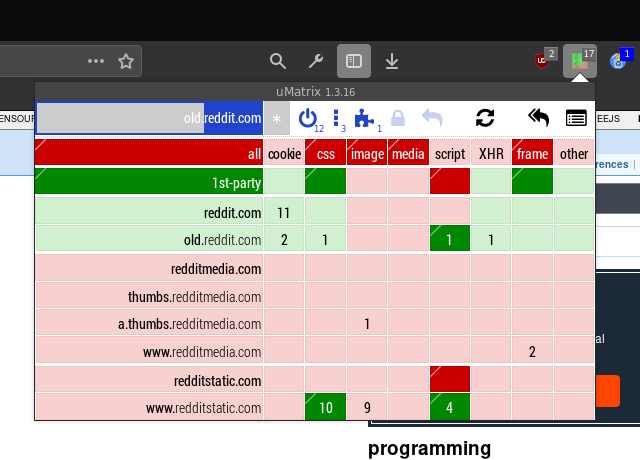

===
- date: 2019-02-15
- name: Your Definition of Privacy is wrong
- tags: privacy, security, web browsers
- type: legacy
===

This week I was researching concepts of alternative Web Browsers, in
especially forks of `Chromium` and `Firefox` that claim to be a
privacy-oriented Web Browser; but actually are not.

Most of the Web Browser Forks go down the rabbit hole up until a
certain point, but stop half-way through. The underlying problem is
that most developers seem not to understand what Privacy actually is,
how it works, and what you should do to ensure it.

Privacy is not Ad-Blocking. Privacy is not Trusting everyone by default.
And Privacy is also not leaking User Identities by default, except to
Third-Parties that are known to be criminals.

In order to define what Privacy is, we first have to take a step back
and understand what Privacy means for the End User. In order to do so,
we have to understand the concept of Trust and Identity before we can
move on to understand what Privacy actually is.

This article will be in the context of the Web and how the Web currently
works; how other people imagine it to work; and what I think about it.
Read with care, most statements are on a very serious level, even when
they don't look like it on first read.


## Web of Identity

First, you have to ask yourself: What is Identity?

I usually symbolize it with a metaphor how I symbolize Trust in my head.

Imagine you're a Web Browser and you are walking around Downtown, you
carry a big, secure (encrypted?) safe with you at all times which stores
important client data about your biggest client. If you lose that client,
you are broke, and that would be bad; so you try to avoid that.

As you are working for a company (namely the ruler of the planet Google,
or even an "honest" foundation like Mozilla) that tries to make money to
feed their developers, so that the developers can help make your life
better.

Now, as you go around in Downtown, you are walking by many shops and you
meet a lot of people that have signs in their hand, trying to sell you
stuff online; trying to pick your pocket, meeting some scammy people in
the dark alley at the side ... everything as you go along.

As you are a Web Browser, you learned that you cannot open any Web Site
these days without telling people who you are first, so you got a big
sign mounted on your head, which reads:

```
IP:            1.2.3.4
User-Agent:    Firefox 64, Arch Linux
Performance:   4 CPU Cores, 8 CPU Threads, Laptop Screen, 2 GPUs
USB:           2 Authn Sticks
Network:       Online, Wi-Fi
Audio Codecs:  FLAC, MP3, OPUS, OGG, WEBP
Video Codecs:  MPEG4, WMV, OGV, WEBM
Camera:        (please ask) Resolution 1024x768 @ 53FPS
Geolocation:   (please ask)
WebGL Support: Fuck yeah, biggest Nvidia you can imagine, even with 8GB of memory!
WebRTC:        My LAN IP is 192.168.1.10, my Router IP is 192.168.1.2
```

And as it's a big sign on your head that is stupid-looking, everybody
watches you and takes notice of that. They see this information publicly
without having you to ask about it, so it's not on your Business Card.

Your Business Card is worse, but that's not the point right now. We are
talking about the information that everybody can see in the public without
ever having to ask you, the Web Browser, whether or not they are allowed
to see it.

As you can imagine, installed Audio and Video Codecs are pretty unique.
Especially on public IPs. In my case, the installation of Linux and FFMPEG
in my geolocation area (that can be traced via the IP) is literally as
unique as `1 only` which means that everybody knows I'm "That particular Linux guy".

Also, chances are very high that my Laptop Hardware is pretty unique, as
even only the amount of CPUs and GPUs is so unique that everybody knows
what kind of hardware I have; and that this hardware is linked just by
that amount of information uniquely back to me without any of the other
data already.

The important part is that the Geolocation is inavoidable to be uniquely
identifiable; no matter what is appearing as the IP; as this is how the
web works. A guy from Palantir once said that you need two pieces of
information; no matter what, and that makes everybody uniquely identifiable.

These two pieces can be pretty much any piece of information about your
Computer. Anything, really. The information that I'm running Linux is
just as unique as the amount of my Nvidia GTX graphics cards or my
real name.

Anyways, it's a lot of data that any Web Browser these days has put as
a big sign on their head, no matter what. The important part is here that
by broadcasting this kind of information it makes you uniquely identifiable;
but the lack of it, does the same, too.

If the sign looked like this, with uBlock Origin and uMatrix Extensions
installed, you would know that I'm that guy, too. The issue is that by
concept, all Extensions must partly run in the foreground and in the
background; which always has to leave traceable global variables in order
to communicate from the background page to the website.

And those global variables can be traced by everyone very easily, actually.
That is how every News Website knows to annoy you even more with overlays
when you are blocking their advertisements for online casinos.

These Web Sites will try to get that information anyways, they will try
to call the APIs, and when there's no data coming back (which is how it
currently works), they will remember that fact, too.

```
IP:            1.2.3.4
User-Agent:    Firefox 64, Arch Linux
Performance:   4 CPU Cores, 8 CPU Threads, Laptop Screen, 2 GPUs
Extensions:    uBlock, uMatrix, Cookie Autodelete
USB:           (classified)
Network:       Online, Wi-Fi
Audio Codecs:  FLAC, MP3, OPUS, OGG, WEBP
Video Codecs:  MPEG4, WMV, OGV, WEBM
Camera:        (please ask) Resolution 1024x768 @ 53FPS
Geolocation:   (please ask)
WebGL Support: (classified)
WebRTC:        (classified)
```

If you would look at this sign on my head, and comparing it to a group of
people standing right next to me that have all different signs on their
heads... would you think that makes me magically not uniquely identifiable?

The answer is no, Blocking in particular makes me uniquely identifiable.
Even worse, it makes me interesting. I have something to hide, so I think
that this piece of information is worth keeping a secret.

It's like having a conversation with a person on the street that asks for
my personal name, and I'm replying with "Sorry, that's classified".

Wouldn't you be suspicious in that situation?

Remember, this pieces of information are not made up. This is literally
what the current Web APIs are broadcasting, and I haven't even started
yet. There are hundreds more of those kind of APIs that send even more
data to every other website that you will come along.

And most of them are actually even more granular than the "has a Webcam"
information.


## Web of Privacy

Usually when you talk with technological people about that topic, they
come up with some Blockchain based solution that will magically solve
this, because it's Blockchain. Period.

My response is: It won't. Because Blockchains, by concept, work on
the principle of consent of the rest of the world (or at least 50%).

That means it makes the information not only publicly available, but
also publicly confirmed and leaves a huge trail of history behind you,
with every piece of information that you said to anyone; ever.

That includes your crush in High School that you told your best friend
about, that includes that time(s) you were wanking off on PornHub and
includes that one time you had a motorcycle accident.

This is by the way why Governments are so interested in Blockchain technology.
It's basically the definition that the Stasi always strived for.

Putting Blockchains aside for the purpose of moving on, the current
situation isn't great either.

Currently, as already mentioned, your Web Browser trusts everyone,
except the ones that are known Criminals (aka Ad-Blocked). In my opinion
this is not a good solution for the underlying problem. In real-life
I cannot afford to give everybody on the street my passport, and wait
for him to be prosecuted until I know that he has a stamp on his hand
that says "Don't trust this guy (again)".

So, in order to fix this, we have to understand how current technologies
work, what they do behind the scenes, and whether or not they actually
increase privacy or not.


### Ad-Blocker Extensions

Ad-Blocker Extensions have a very high maintenance overhead, as they in
general only block something after something bad happened before already.

Chances are very likely that not everything can be blocked at all points
in time; and that update frequencies of block hosts lists (and rules
for blocking particular URLs) don't work well, and something always slips
through.

So, in extend to uBlock, uMatrix and Cookie Autodelete I usually recommend
them to actually disable JavaScript by default.

The problem is, that in practice, shit doesn't work. And I mean, like, all
the time. Want to order something on eBay and make a PayPal transaction?
Forget about it. You're blocked for the next 48h. You have to confirm
anti-bot-fraud-detection scripts like hundreds of times; and after half
an hour you give zero fucks and start to unblock everything just for the
sake of not having to deal with it anymore.


### VPN and TOR Proxies

Usually when you ask IT Guys they will tell you to use VPN or TOR Proxies
because they are encrypted and a safe way to communicate with the Web.

But hang on here, encrypted transport of the request doesn't mean that
the connection itself is encrypted. And neither does it mean that it doesn't
make you even more unique.

As mentioned before, your Browser delivers many pieces of information,
and even without the IP (and therefore Geolocation area) information it
is too much and uniquely identifiable.

Even the TOR Browser has this problem. Literally, the screen size made
it possible to uniquely identify a system when a TOR Browser was surfing
the Web. I'm sure the people behind TOR are trustworthy in what they
do, but I'm not sure about what they are able to identify as possible
leaks of information that come with the underlying Web Engine (Gecko)
itself.


### Web Browsers

Meanwhile, I learned to not trust anything in the Web Browser world.
Mozilla is tracking just as many things as Google, yet they claim to
be the better privacy-respecting guys. This is a serious fraud case
in my opinion.

In order to make your own opinion, just go to `about:config` and enter
`URL` as a keyword. You will be mindblown what pieces of information
are sent to the Internet without you being able to actually disable
it.

Mozilla assumes that the transfer via HTTPS is safe, so they basically
think it's okay to send everything without reasonable obfuscation.

1. Mozilla makes mistakes, too. They're human developers after all.
2. Never trust anything by default.
3. I'm sure the NSA has found some awesome `NULL`ing bug for TLS, too - which we yet have to find.
4. Again, never trust anything by default. Not even TLS.
5. IETF consists of humans, too. They make mistakes, too.


### Firefox Settings for the Paranoid User

In the Firefox Settings, you can modify many things. Though I think
that the way of doing it is wrong, it can be configured as an
as-good-as-it-can-be solution to browse the Web (via TOR, of course).

So I'm sharing my `prefs.js` file for my Firefox Profile folder here
that you can read, understand, and maybe use yourself. Note that
Firefox alone without all necessary Web Extensions doesn't make
browsing the Web anonymous either; but it's a good start.

Installed Web Extensions:

- [uBlock Origin](https://addons.mozilla.org/en-US/firefox/addon/ublock-origin/)
- [uMatrix](https://addons.mozilla.org/en-US/firefox/addon/umatrix/)
- [Cookie Autodelete](https://addons.mozilla.org/en-US/firefox/addon/cookie-autodelete/)
- [HTTPS Everywhere](https://addons.mozilla.org/en-US/firefox/addon/https-everywhere/)

Note: The `prefs.js` can be used as an incrementally-overwriting
`user.js` in the Firefox Profile folder. If you want to overwrite
Firefox's Settings incrementally, rename it to `user.js`.

- [prefs.js](./your-definition-of-privacy-is-wrong/prefs.js)


## Web of Trust

By default, you should not Trust any Web Site to do the right thing
and you should block all Features that the Web Site could use in
order to track you (or your user behaviour) down.

In my personal opinion, JavaScript should never be necessary to use
a Web Site. But I guess the modern trend of Web Design "3.0" is not
what I associate with good Web Design anymore.

Anyhow, Trust needs to be established on historic behaviour. I
personally allow only specific Features for Web Sites I visit
regularly (and even then I'm denying them to set persistent
Cookies) in order to prevent malicious behaviour.

The Web should be used based on Trust for specific Features, not
based on Assumptions about Circumstances. That sums up pretty much
how you should use the Internet.


### uMatrix Usage

By default, you should block all interactive content in order to
prevent malicious websites to slip through.

If you trust a specific website and visit it regularly, you should
use a specific whitelist for that specific website only, in order
to prevent unwanted third-party non-blocked trackers from loading
unwanted content or media.



I know, it's a trade-off with usability. But believe me, the web
will get blazing fast again this way. The necessary uMatrix rules
to get you started are these:

**uMatrix Rules**:

```
https-strict: behind-the-scene false
matrix-off: about-scheme true
matrix-off: behind-the-scene true
matrix-off: chrome-extension-scheme true
matrix-off: chrome-scheme true
matrix-off: moz-extension-scheme true
matrix-off: opera-scheme true
matrix-off: vivaldi-scheme true
matrix-off: wyciwyg-scheme true
no-workers: * true
noscript-spoof: * true
referrer-spoof: * true
referrer-spoof: behind-the-scene false
* * * block
* * css block
* * frame block
* * image allow
* * media block
* * script block
* 1st-party * allow
* 1st-party css allow
* 1st-party frame allow
```


## Going Further

So, you might ask, where does that leave us, currently?

- Can we trust Web Browser? No.
- Can we trust Web Sites? No.
- Can we trust Cookie not to be a Tinfoil-Hat? No.
- Can we trust Governments? Especially No.
- Can we still believe in Democracy? Hopefully yes.


If you want to go even further than the recommended solution in this
article, you might wanna check up on my current project, the
Web Browser/Scraper/Proxy called [Stealth](https://github.com/cookiengineer/stealth).

Stealth was created because I'm unsatisifed how the Web works, and
I think this needs to be fixed and implemented fundamentally
differently to protect the rights and freedoms of people using
the Internet.

